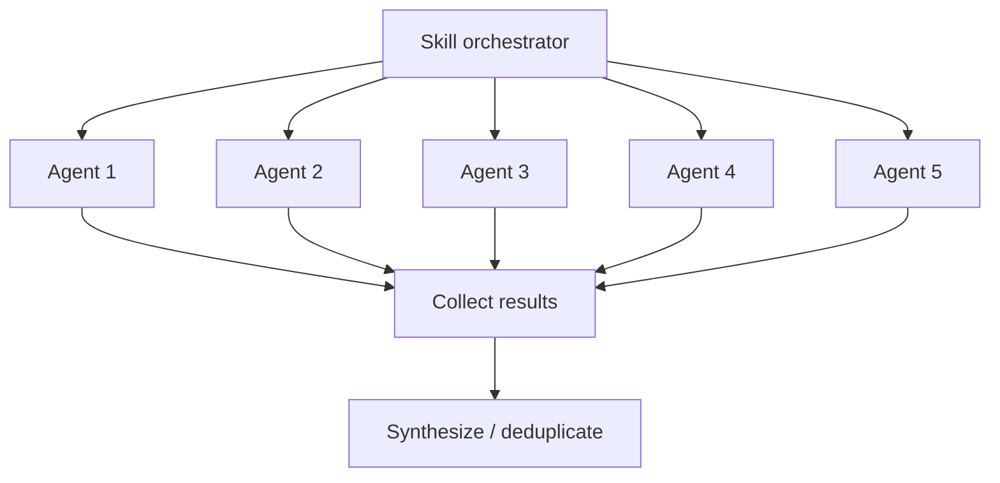

# Agent System

How Larch skills orchestrate parallel subagents for collaborative multi-perspective workflows.

## What Are Agents?

In Claude Code, **agent** = subprocess spawned via Agent tool. Run autonomous, own context window. Each get prompt, defined tools, return result when done. Agents isolated — no see each other output, no share state.

## How Skills Use Agents

Skills launch agents to parallelize work benefiting from multiple independent perspectives. Key patterns:

### Parallel Fan-Out

Many agents launch same time, each examine same material from different angle. Collect + synthesize after all return.

Used for:

- **[Collaborative sketches](collaborative-sketches.md)** — 5 agents propose architecture in parallel (1 Claude + 2 Cursor + 2 Codex)
- **Plan review** — 3 reviewers examine plan same time (1 Claude Code Reviewer subagent + 1 Codex + 1 Cursor)
- **Code review** — 3 reviewers examine diff same time (1 Claude Code Reviewer subagent + 1 Codex + 1 Cursor)
- **[Voting](voting-process.md)** — 3 voters evaluate findings in parallel

### Sequential Composition

Skills invoke other skills in sequence, each build on previous. Example: `/implement` invokes `/design` first, then implement plan, then invokes `/review` on implementation.

## Agent Types

Larch use several agent categories:

### Review Agent

1 persistent [Code Reviewer archetype](review-agents.md) — unified reviewer cover code quality, risk/integration, correctness, architecture, security. Defined in `agents/code-reviewer.md` (generated from `skills/shared/reviewer-templates.md` via `scripts/generate-code-reviewer-agent.sh`; discovered via `${CLAUDE_PLUGIN_ROOT}`) with model: sonnet (default) + Read/Grep/Glob tool access. In `/design`, `/review`, `/loop-review` (per slice), `/research` (per validation phase), exactly one Claude Code Reviewer subagent run alongside 1 Codex + 1 Cursor (3-reviewer panel). Degraded-mode rule: one Claude Code Reviewer subagent fallback replace each unavailable external slot — Codex alone unavailable → panel = 2 Claude + 1 Cursor; Cursor alone unavailable → 2 Claude + 1 Codex; both unavailable → 3 Claude lanes (always-on lane plus 2 fallbacks, each invoked as distinct `code-reviewer` subagent). Preserves 3-lane invariant every combo.

### Sketch Agents

5 agents in [collaborative sketch phase](collaborative-sketches.md): 1 Claude (General, orchestrator inline) + 2 Cursor slots (Architecture/Standards + Edge-cases/Failure-modes) + 2 Codex slots (Innovation/Exploration + Pragmatism/Safety). When external tool unavailable, affected slot fall back to Claude subagent with matching personality prompt. Ephemeral — launched with inline prompts, not persistent agent definitions.

### Dialectic Debaters

Used by `/design` Step 2a.5 to resolve contested design decisions from sketch phase. Up to `min(5, |contested-decisions|)` decisions selected (priority order); each decision thesis + antithesis both run on single external tool via deterministic per-decision bucketing: **odd-indexed decisions (1, 3, 5) → Cursor**; **even-indexed decisions (2, 4) → Codex**. Both sides of bucket use same tool.

**No Claude substitution (debate only)**: when assigned tool unavailable, decision bucket **skipped entirely** + `Disposition: bucket-skipped` resolution written (synthesis decision stands for that point). Claude Code Reviewer subagents **never** substituted into debate path. Intentional divergence from repo-wide replacement-first pattern used by review/voting/sketch fallbacks — debaters produce adversarial arguments where model-specific writing style could encode tool identity + bias downstream judge panel. See `skills/shared/dialectic-protocol.md` for full protocol.

Debaters produce tagged structured output (`<claim>`, `<evidence>`, `<strongest_concession>`, `<counter_to_opposition>`, `<risk_if_wrong>`, terminal `RECOMMEND:` line). Eligibility gate filter outputs miss required tag, carry wrong RECOMMEND token, or fail role-vs-RECOMMEND consistency — failed decisions fall back to synthesis with reason code rather than poison judge panel. Ephemeral.

### Dialectic Judges

After debate, 3-judge panel read attribution-stripped ballot (Defense A / Defense B labels per decision, deterministic position-order rotation across decisions to cancel position bias) + cast one binary `THESIS` / `ANTI_THESIS` vote per decision. Panel composition = Cursor + Codex + Claude Code Reviewer subagent, with **replacement-first** fallbacks — when Cursor or Codex unhealthy, Claude Code Reviewer subagent replace slot so panel always 3 slots.

**Replacement-first applies to judges, not debaters**: judges merely adjudicate between pre-authored defenses, stylistic attribution leak no concern for judge role; "no Claude substitution" rule scoped to adversarial debate phase only. Dialectic-local health re-probe run immediately before judge launch so debate-time Cursor/Codex timeout no lock tool out of judging. Judge-panel flags (`judge_codex_available`, `judge_cursor_available`) judge-phase-local, never mutate orchestrator-wide availability. See `skills/shared/dialectic-protocol.md` for ballot format, judge prompt template, threshold rules, resolution schema.

### Voting Panel Agents

3 voters in [voting process](voting-process.md) (Claude Code Reviewer subagent + Codex + Cursor). Ephemeral agents launched with ballot + voting instructions.

### Research Agents

3 research agents in `/research` (Claude inline + Cursor + Codex) investigate question under single uniform brief, then 3-reviewer validation panel (1 Claude Code Reviewer subagent + 1 Codex + 1 Cursor). Claude Code Reviewer subagent fallbacks preserve 3-lane invariant when external tool unavailable. All ephemeral.

## Context Isolation

Each agent run own context window:

- Agents **cannot** see each other output during execution
- Agents **cannot** communicate with each other
- Orchestrating skill collect all results + perform synthesis
- Isolation by design — ensure independent perspectives, prevent groupthink

## Tool Access

Agents have restricted tool access by role:

- **Review agents** — Read, Grep, Glob only (no modify files)
- **Sketch agents** — Read, Grep, Glob only (research phase)
- **Voting agents** — Read, Grep, Glob only (evaluation phase)
- **Implementation agents** — Full tool access when implementing fixes

External tools (Codex, Cursor) have own tool access controlled by their platforms. See [External Reviewers](external-reviewers.md) for integration details.

## Performance Optimization

Skills optimize agent usage:

1. **Launch order** — Slowest agents (Cursor) first, fastest (Claude) last
2. **Background execution** — External tools run in background while Claude agents execute
3. **Early processing** — Claude subagent results processed immediately while wait for slower external reviewers
4. **Sentinel-based coordination** — `.done` files signal completion without polling output
