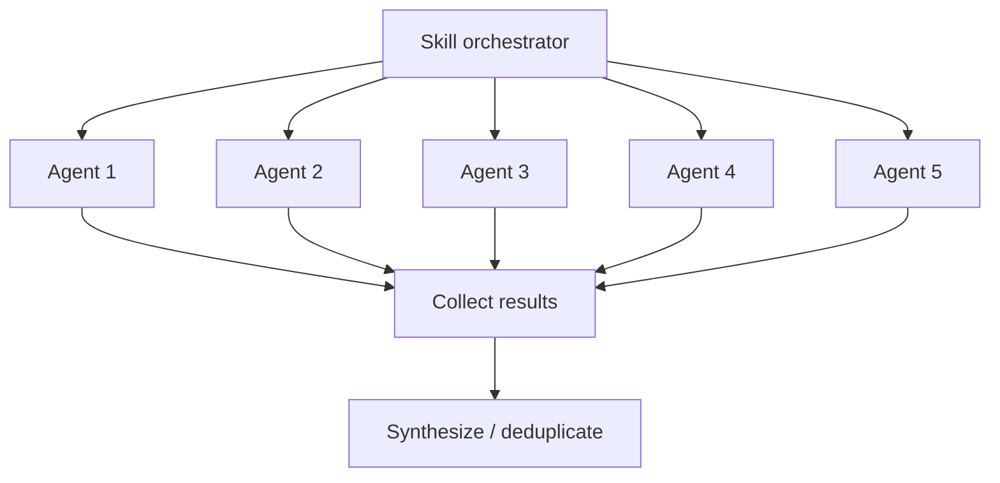

# Agent System

How Larch skills orchestrate parallel subagents to achieve collaborative multi-perspective workflows.

## What Are Agents?

In the Claude Code context, an **agent** is a subprocess spawned via the Agent tool that runs autonomously with its own context window. Each agent receives a prompt, has access to a defined set of tools, and returns a result when complete. Agents are isolated from each other — they cannot see each other's outputs or share state.

## How Skills Use Agents

Skills launch agents to parallelize work that benefits from multiple independent perspectives. The key patterns:

### Parallel Fan-Out

Multiple agents are launched simultaneously, each examining the same material from a different angle. Results are collected and synthesized after all agents return.

This pattern is used for:

- **[Collaborative sketches](collaborative-sketches.md)** — 5 agents propose architectural approaches in parallel (1 Claude + 2 Cursor + 2 Codex)
- **Plan review** — 3 reviewers examine the implementation plan simultaneously (1 Claude Code Reviewer subagent + 1 Codex + 1 Cursor)
- **Code review** — 3 reviewers examine the diff simultaneously (1 Claude Code Reviewer subagent + 1 Codex + 1 Cursor)
- **[Voting](voting-process.md)** — 3 voters evaluate findings in parallel

### Sequential Composition

Skills invoke other skills in sequence, each building on the previous result. For example, `/implement` invokes `/design` first, then implements the resulting plan, then invokes `/review` on the implementation.

## Agent Types

Larch uses several categories of agents:

### Review Agent

The 1 persistent [Code Reviewer archetype](review-agents.md) — a unified reviewer covering code quality, risk/integration, correctness, architecture, and security. Defined in `agents/code-reviewer.md` (generated from `skills/shared/reviewer-templates.md` via `scripts/generate-code-reviewer-agent.sh`; discovered via `${CLAUDE_PLUGIN_ROOT}`) with model: sonnet (default) and Read/Grep/Glob tool access. In `/design`, `/review`, `/loop-review` (per slice), and `/research` (per validation phase), exactly one Claude Code Reviewer subagent runs alongside 1 Codex and 1 Cursor (3-reviewer panel). Degraded-mode rule: one Claude Code Reviewer subagent fallback replaces each unavailable external slot — when Codex alone is unavailable, the panel is 2 Claude + 1 Cursor; when Cursor alone is unavailable, 2 Claude + 1 Codex; when both are unavailable, 3 Claude lanes (the always-on lane plus 2 fallbacks, each invoked as a distinct `code-reviewer` subagent). This preserves the 3-lane invariant in every combination.

### Sketch Agents

The 5 agents in the [collaborative sketch phase](collaborative-sketches.md): 1 Claude (General, orchestrator inline) + 2 Cursor slots (Architecture/Standards + Edge-cases/Failure-modes) + 2 Codex slots (Innovation/Exploration + Pragmatism/Safety). When an external tool is unavailable, the affected slot falls back to a Claude subagent with the matching personality prompt. These are ephemeral — launched with inline prompts, not persistent agent definitions.

### Dialectic Debaters

Used by `/design` Step 2a.5 to resolve contested design decisions surfaced by the sketch phase. Up to `min(5, |contested-decisions|)` decisions are selected (priority order); each decision's thesis + antithesis both run on a single external tool via deterministic per-decision bucketing: **odd-indexed decisions (1, 3, 5) → Cursor**; **even-indexed decisions (2, 4) → Codex**. Both sides of a bucket use the same tool.

**No Claude substitution (debate only)**: when the assigned tool is unavailable, that decision's bucket is **skipped entirely** and a `Disposition: bucket-skipped` resolution is written (synthesis decision stands for that point). Claude Code Reviewer subagents are **never** substituted into the debate path. This is an intentional divergence from the repo-wide replacement-first pattern used by review/voting/sketch fallbacks — debaters produce adversarial arguments where model-specific writing style could encode tool identity and bias the downstream judge panel. See `skills/shared/dialectic-protocol.md` for the full protocol.

Debaters produce tagged structured output (`<claim>`, `<evidence>`, `<strongest_concession>`, `<counter_to_opposition>`, `<risk_if_wrong>`, terminal `RECOMMEND:` line). An eligibility gate filters outputs that miss any required tag, carry the wrong RECOMMEND token, or fail role-vs-RECOMMEND consistency — failed decisions fall back to synthesis with a reason code rather than poison the judge panel. These agents are ephemeral.

### Dialectic Judges

After debate, the 3-judge panel reads an attribution-stripped ballot (Defense A / Defense B labels per decision, deterministic position-order rotation across decisions to cancel position bias) and casts one binary `THESIS` / `ANTI_THESIS` vote per decision. The panel composition is Cursor + Codex + Claude Code Reviewer subagent, with **replacement-first** fallbacks — when Cursor or Codex is unhealthy, a Claude Code Reviewer subagent replaces that slot so the panel always remains at 3 slots.

**Replacement-first applies to judges, not debaters**: judges merely adjudicate between pre-authored defenses, so stylistic attribution leak is not a concern for the judge role; the "no Claude substitution" rule is scoped to the adversarial debate phase only. A dialectic-local health re-probe runs immediately before judge launch so a debate-time Cursor/Codex timeout does not lock that tool out of judging. Judge-panel flags (`judge_codex_available`, `judge_cursor_available`) are judge-phase-local and never mutate orchestrator-wide availability. See `skills/shared/dialectic-protocol.md` for the ballot format, judge prompt template, threshold rules, and resolution schema.

### Voting Panel Agents

The 3 voters in the [voting process](voting-process.md) (Claude Code Reviewer subagent + Codex + Cursor). These are ephemeral agents launched with the ballot and voting instructions.

### Research Agents

The 3 research agents in `/research` (Claude inline + Cursor + Codex) that investigate a question under a single uniform brief, followed by a 3-reviewer validation panel (1 Claude Code Reviewer subagent + 1 Codex + 1 Cursor). Claude Code Reviewer subagent fallbacks preserve the 3-lane invariant when an external tool is unavailable. All are ephemeral.

## Context Isolation

Each agent runs in its own context window:

- Agents **cannot** see each other's outputs during execution
- Agents **cannot** communicate with each other
- The orchestrating skill collects all results and performs synthesis
- This isolation is by design — it ensures independent perspectives and prevents groupthink

## Tool Access

Agents have restricted tool access depending on their role:

- **Review agents** — Read, Grep, Glob only (cannot modify files)
- **Sketch agents** — Read, Grep, Glob only (research phase)
- **Voting agents** — Read, Grep, Glob only (evaluation phase)
- **Implementation agents** — Full tool access when implementing fixes

External tools (Codex, Cursor) have their own tool access controlled by their respective platforms. See [External Reviewers](external-reviewers.md) for integration details.

## Performance Optimization

Skills optimize agent usage through:

1. **Launch order** — Slowest agents (Cursor) launched first, fastest (Claude) launched last
2. **Background execution** — External tools run in background while Claude agents execute
3. **Early processing** — Claude subagent results are processed immediately while waiting for slower external reviewers
4. **Sentinel-based coordination** — `.done` files signal completion without polling the output
