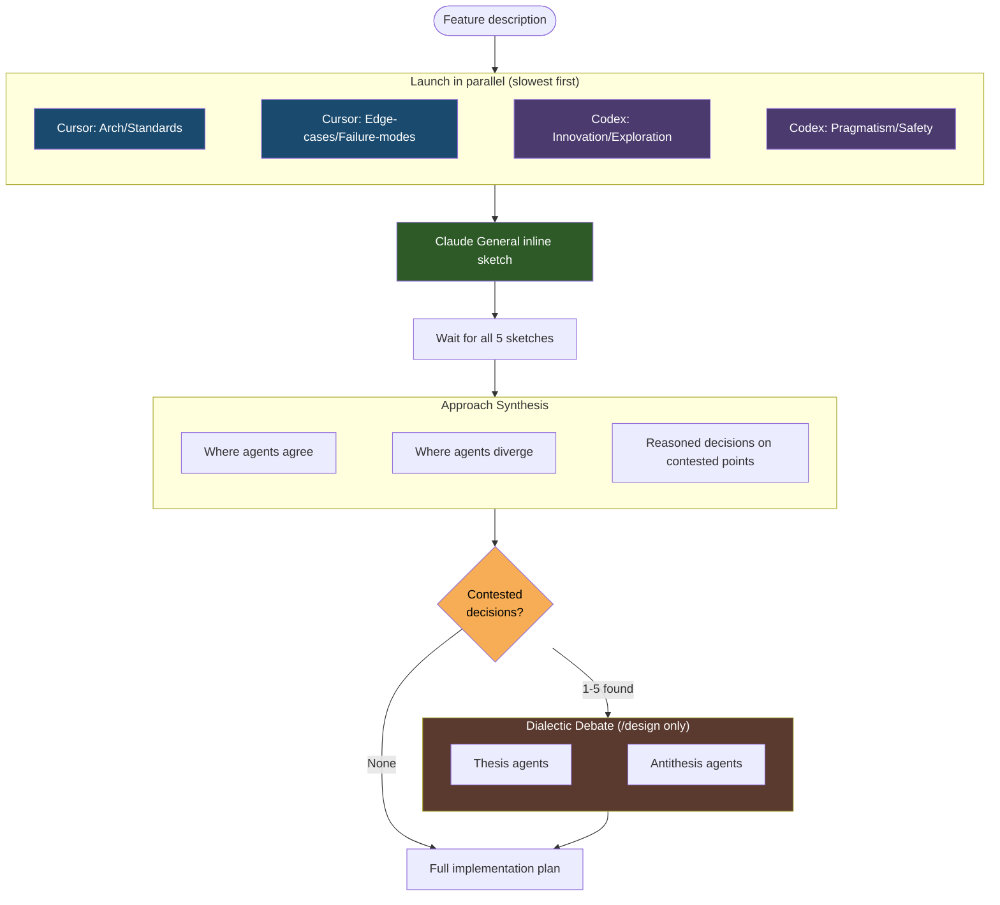

# Collaborative Sketches

Collaborative sketch phase = diverge-then-converge in `/design`. 5 agents independently propose architecture before full plan written. Stop anchoring bias — one perspective lock direction before alternatives seen.

## Why Sketches Exist

No sketch phase = first idea win. 5 agents explore design space independently. Surface different views early — while architecture still movable — not at review when plan already anchored.

## The 5 Sketch Agents

Sketch phase always use exactly 5 agents: 1 Claude subagent (orchestrator inline sketch) + 4 external slots (2 Cursor + 2 Codex) carrying four non-general personalities. Each external slot have Claude subagent fallback when tool down.

| Agent | Harness | Role | Focus |
|---|---|---|---|
| **Claude (General)** | Inline (orchestrator) | Orchestrator's own sketch | Key decisions, files to modify, tradeoffs |
| **Cursor slot 1** (fallback: Claude) | Cursor | Architecture/Standards | Clean design, proper layering, reuse of existing libraries |
| **Cursor slot 2** (fallback: Claude) | Cursor | Edge-cases/Failure-modes | Boundary conditions, error handling, failure recovery |
| **Codex slot 1** (fallback: Claude) | Codex | Innovation/Exploration | Creative alternatives, unconventional solutions, questioned assumptions |
| **Codex slot 2** (fallback: Claude) | Codex | Pragmatism/Safety | Smallest change set, avoid regressions, protect existing features |

### Important Distinction

5 sketch agents **completely separate** from 3 plan-review agents that judge plan later in `/design` Step 3. Sketch agents explore design space (5 views); plan reviewers validate final plan (3-reviewer panel: 1 Claude Code Reviewer subagent + 1 Codex + 1 Cursor). Different roles, different prompts, different purpose.

## Per-Slot Fallback

Cursor or Codex down → affected slot fall back to Claude subagent carrying **same personality prompt** as original external slot. Keep always-5-agents and always-5-personalities invariants regardless of tool health.

## Fallback Behavior by Phase

Handling of unavailable external tools differ by phase:

| Phase | Unavailable Tool Handling |
|---|---|
| **Sketch phase** (`/design`) | Per-slot Claude fallbacks with matching personality — always 5 agents |
| **Plan review** (`/design`) | Claude Code Reviewer subagent fallbacks — always 3 reviewers |
| **Code review** (`/review`) | Claude Code Reviewer subagent fallbacks — always 3 reviewers |
| **Voting** | Claude replacement voters used — always 3 voters. 3 voters: 2+ YES to accept; 2 voters: unanimous YES; <2 voters: voting skipped, all findings accepted |
| **Dialectic debate** (`/design`) | **No Claude substitution for debaters** — when the assigned external tool (Cursor for odd-indexed decisions, Codex for even-indexed) is unavailable, that decision's debater bucket is skipped entirely and a `Disposition: bucket-skipped` resolution is written (synthesis decision stands). Intentional divergence from the rules above for debate execution only; see Step 2a.5 in `skills/design/SKILL.md` |
| **Dialectic judge panel** (`/design`) | **Claude replacements keep the panel at 3** — the post-debate 3-judge panel (Claude Code Reviewer subagent + Codex + Cursor) follows the repo-wide replacement-first pattern. When an external judge tool is unhealthy, a Claude Code Reviewer subagent replaces that slot. Judges merely adjudicate between pre-authored defenses — the no-Claude rule applies to adversarial debate execution only, not to adjudication. See `skills/shared/dialectic-protocol.md` |

## How It Works

1. **Parallel launch** — All external + per-slot Claude fallback sketches launch at same time. Both Cursor slots first (slowest), then both Codex, then any Claude fallback. Orchestrator write own General sketch last, before reading others, keep independence.

2. **Each agent produces** 2-3 paragraph sketch covering:
   - Key architectural decisions and approach
   - Which files/modules to modify and why
   - Main tradeoffs to consider

3. **Synthesis** — After all 5 sketches return, orchestrator produce synthesis that:
   - Identifies where approaches agree (likely the majority)
   - Identifies divergence points and makes reasoned calls with justification
   - Notes which ideas from each sketch are incorporated
   - Highlights **Architecture/Standards** concerns sourced from Cursor slot 1
   - Highlights **Pragmatism/Safety** warnings sourced from Codex slot 2
   - Surfaces **Edge-case/Failure-mode** risks sourced from Cursor slot 2
   - Notes **Innovation/Exploration** alternatives sourced from Codex slot 1 that are worth preserving as options
   - Lists contested decisions in a structured format for the dialectic debate phase

4. **Dialectic debate and adjudication** (`/design` only) — Synthesis find contested decisions (points where sketches really diverged) → up to 5 (priority order) go to structured thesis/antithesis debates run on Cursor and Codex via deterministic per-decision bucketing. Per contested decision, thesis agent defend synthesis choice, antithesis argue strongest alternative. Both run parallel with codebase access. Successful debates then forwarded to **3-judge binary panel** (Claude Code Reviewer subagent + Codex + Cursor, Claude replacements when externals down) casting `THESIS` / `ANTI_THESIS` votes per decision. Orchestrator write resolutions as panel direct, record `Disposition: voted | fallback-to-synthesis | bucket-skipped | over-cap` per decision. Step skipped when all sketches agree. See [Dialectic Debate](#dialectic-debate-design-only) below; adjudication protocol in `skills/shared/dialectic-protocol.md`.

5. **Full plan** — Synthesis + any dialectic resolutions feed full implementation plan, then submitted to 3-reviewer panel (1 Claude Code Reviewer subagent + 1 Codex + 1 Cursor) for validation.

## Dialectic Debate (/design only)

> **Note**: This phase applies only to `/design`. `/research` does not include a dialectic debate step.

Dialectic debate add reasoning depth on contested points without killing breadth-of-views from sketch phase. Fix specific weakness in convergence: when synthesis find divergence points, orchestrator otherwise unilaterally resolve them — exactly where confirmation bias creep in. Since Phase 3, adjudication between two defenses delegated to 3-judge panel, not orchestrator, further decorrelate adjudication signal from agent that made synthesis.

### When It Runs

Dialectic debate run only when synthesis in Step 2a.4 find real contested decisions — points where multiple sketches propose fundamentally different approaches. All 5 sketches agree → debate skipped entirely.

### How It Works

Per contested decision (up to 5, prioritized by impact):

1. **thesis agent** defend approach chosen by synthesis, argue why right call given codebase + requirements
2. **antithesis agent** attack that choice, argue strongest alternative, poke hidden assumptions, surface risks synthesis glossed over

Both agents run parallel, produce tagged structured output. **eligibility gate** require both sides report `STATUS=OK` from collector + pass structural quality checks (5 required tags, single `RECOMMEND:` line, role-vs-RECOMMEND consistency, evidence citation) before decision forwarded to judge ballot. Either side fail gate → decision `Disposition` = `fallback-to-synthesis`, synthesis decision stands for that point.

After eligibility gate, successful debates go to **3-judge binary panel** (Claude Code Reviewer subagent + Codex + Cursor, Claude replacements when externals unhealthy — replacement-first, panel always 3). Panel read attribution-stripped ballot (Defense A / Defense B with deterministic position-order rotation across decisions) + cast one binary vote per decision: `THESIS` (side defending synthesis choice wins) or `ANTI_THESIS` (alternative wins). Orchestrator write resolutions as panel vote tally direct: 3 judges → majority 2+ wins; 2 judges → unanimous required (1-1 tie → `fallback-to-synthesis`); <2 judges → `fallback-to-synthesis`. See `skills/shared/dialectic-protocol.md` for authoritative protocol.

### Scope of Resolutions

Dialectic resolutions **binding for Step 2b** (plan generation) only. May be overridden by accepted findings from Step 3 plan review. Final plan stay sole canonical output.
