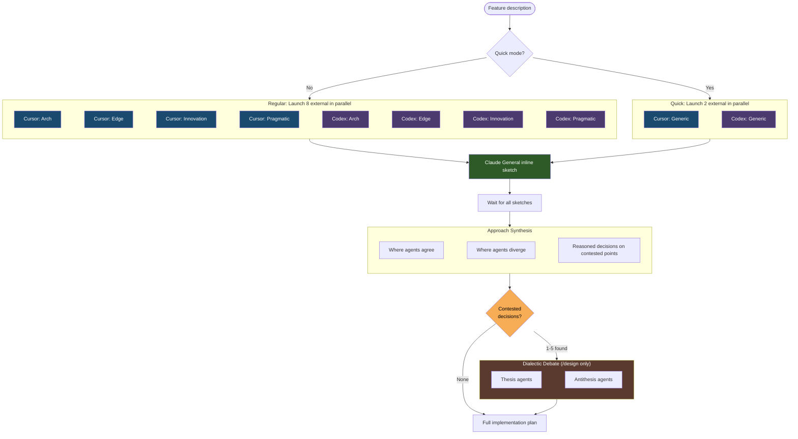

# Collaborative Sketches

The collaborative sketch phase is a diverge-then-converge process in `/design` where multiple agents independently propose architectural approaches before the full implementation plan is written. This prevents anchoring bias — where a single perspective locks in the direction before alternatives are considered.

## Why Sketches Exist

Without the sketch phase, the first idea considered tends to dominate the plan. By having multiple agents independently explore the design space, the system surfaces different perspectives early — when they can still influence the architectural direction — rather than waiting for review when the plan is already anchored.

## Sketch Agents

The sketch phase runs 9 agents in regular mode (4 Cursor + 4 Codex + 1 Claude), or 3 in quick mode (1 Cursor + 1 Codex + 1 Claude). Each external slot has a Claude subagent fallback that activates when the respective tool is unavailable, preserving the configured lane count.

### Regular Mode (9 agents)

Each of the 4 personalities gets both a Cursor and a Codex instance:

| Agent | Harness | Role | Focus |
|---|---|---|---|
| **Claude (General)** | Inline (orchestrator) | Orchestrator's own sketch | Key decisions, files to modify, tradeoffs |
| **Cursor — Arch** (fallback: Claude) | Cursor | Architecture/Standards | Clean design, proper layering, reuse of existing libraries |
| **Cursor — Edge** (fallback: Claude) | Cursor | Edge-cases/Failure-modes | Boundary conditions, error handling, failure recovery |
| **Cursor — Innovation** (fallback: Claude) | Cursor | Innovation/Exploration | Creative alternatives, unconventional solutions, questioned assumptions |
| **Cursor — Pragmatic** (fallback: Claude) | Cursor | Pragmatism/Safety | Smallest change set, avoid regressions, protect existing features |
| **Codex — Arch** (fallback: Claude) | Codex | Architecture/Standards | Clean design, proper layering, reuse of existing libraries |
| **Codex — Edge** (fallback: Claude) | Codex | Edge-cases/Failure-modes | Boundary conditions, error handling, failure recovery |
| **Codex — Innovation** (fallback: Claude) | Codex | Innovation/Exploration | Creative alternatives, unconventional solutions, questioned assumptions |
| **Codex — Pragmatic** (fallback: Claude) | Codex | Pragmatism/Safety | Smallest change set, avoid regressions, protect existing features |

### Quick Mode (3 agents)

A lightweight path using generic (non-personality-specialized) prompts:

| Agent | Harness | Role | Focus |
|---|---|---|---|
| **Claude (General)** | Inline (orchestrator) | Orchestrator's own sketch | Key decisions, files to modify, tradeoffs |
| **Cursor — Generic** (fallback: Claude) | Cursor | General sketch | Broad-scope approach without personality specialization |
| **Codex — Generic** (fallback: Claude) | Codex | General sketch | Broad-scope approach without personality specialization |

### Important Distinction

The sketch agents are **completely separate** from the 6 plan-review agents that evaluate the plan later in `/design` Step 3. The sketch agents explore the design space; the plan reviewers validate the resulting plan (6-reviewer panel: 1 Claude Code Reviewer subagent + 1 Codex generic + 4 Cursor archetypes). They have different roles, different prompts, and serve different purposes.

## Per-Slot Fallback

When Cursor or Codex is unavailable, each affected slot falls back to a Claude subagent carrying the **same prompt** as the original external slot. This preserves the configured lane count (9 in regular mode, 3 in quick mode) regardless of external tool availability.

## Fallback Behavior by Phase

The handling of unavailable external tools differs across workflow phases:

| Phase | Unavailable Tool Handling |
|---|---|
| **Sketch phase** (`/design`) | Per-slot Claude fallbacks with matching prompt — 9 agents in regular mode, 3 in quick mode |
| **Plan review** (`/design`) | Per-archetype Cursor → Codex → Claude fallback chain; Codex generic → Claude — always 6 reviewers |
| **Code review** (`/review`) | Cursor down → Codex fills specialist slots; Codex down → Claude generic replaces Codex slot; both down → 1 Claude generic (voting skipped per threshold rules) |
| **Voting** | Claude replacement voters used — always 3 voters. 3 voters: 2+ YES to accept; 2 voters: unanimous YES; <2 voters: voting skipped, all findings accepted |
| **Dialectic debate** (`/design`) | **No Claude substitution for debaters** — when the assigned external tool (Cursor for odd-indexed decisions, Codex for even-indexed) is unavailable, that decision's debater bucket is skipped entirely and a `Disposition: bucket-skipped` resolution is written (synthesis decision stands). Intentional divergence from the rules above for debate execution only; see Step 2a.5 in `skills/design/SKILL.md` |
| **Dialectic judge panel** (`/design`) | **Claude replacements keep the panel at 3** — the post-debate 3-judge panel (Claude Code Reviewer subagent + Codex + Cursor) follows the repo-wide replacement-first pattern. When an external judge tool is unhealthy, a Claude Code Reviewer subagent replaces that slot. Judges merely adjudicate between pre-authored defenses — the no-Claude rule applies to adversarial debate execution only, not to adjudication. See `skills/shared/dialectic-protocol.md` |

## How It Works

1. **Parallel launch** — All external and per-slot Claude fallback sketches are launched simultaneously. In regular mode: all 4 Cursor slots first (slowest), then all 4 Codex slots, then any Claude fallback sketches. In quick mode: Cursor-Generic first, then Codex-Generic. The orchestrating agent writes its own General sketch last, before reading any others, to preserve independence.

2. **Each agent produces** a 2-3 paragraph sketch covering:
   - Key architectural decisions and approach
   - Which files/modules to modify and why
   - Main tradeoffs to consider

3. **Synthesis** — After all sketches return, the orchestrating agent produces a synthesis that:
   - Identifies where approaches agree (likely the majority)
   - Identifies divergence points and makes reasoned calls with justification
   - Notes which ideas from each sketch are incorporated
   - (Regular mode only) Highlights personality-specific concerns: **Architecture/Standards**, **Pragmatism/Safety**, **Edge-case/Failure-mode**, **Innovation/Exploration**
   - (Quick mode) Attributes by tool (Cursor-Generic vs Codex-Generic vs Claude General)
   - Lists contested decisions in a structured format for the dialectic debate phase

4. **Dialectic debate and adjudication** (`/design` only) — If the synthesis identifies contested decisions (points where sketches genuinely diverged), up to 5 (in priority order) are submitted to structured thesis/antithesis debates run on Cursor and Codex via deterministic per-decision bucketing. For each contested decision, a thesis agent defends the synthesis choice and an antithesis agent argues for the strongest alternative. Both run in parallel with codebase access. Successful debates are then forwarded to a **3-judge binary panel** (Claude Code Reviewer subagent + Codex + Cursor, with Claude replacements when externals are unavailable) that casts `THESIS` / `ANTI_THESIS` votes on each decision. The orchestrator writes resolutions as directed by the panel, recording `Disposition: voted | fallback-to-synthesis | bucket-skipped | over-cap` per decision. This step is skipped when all sketches agree. See [Dialectic Debate](#dialectic-debate-design-only) below for details; the adjudication protocol is defined in `skills/shared/dialectic-protocol.md`.

5. **Full plan** — The synthesis and any dialectic resolutions inform the complete implementation plan, which is then submitted to the 6-reviewer panel (1 Claude Code Reviewer subagent + 1 Codex generic + 4 Cursor archetypes) for validation.

## Dialectic Debate (/design only)

> **Note**: This phase applies only to `/design`. `/research` does not include a dialectic debate step.

The dialectic debate phase adds reasoning depth on contested points without replacing the breadth-of-perspectives from the sketch phase. It addresses a specific weakness in the convergence step: when the synthesis identifies divergence points, the orchestrator would otherwise unilaterally resolve them — exactly where confirmation bias can creep in. Since Phase 3, adjudication between the two defenses is delegated to a 3-judge panel rather than the orchestrator, further decorrelating the adjudication signal from the agent that produced the synthesis.

### When It Runs

The dialectic debate runs only when the synthesis in Step 2a.4 identifies genuine contested decisions — points where multiple sketches proposed fundamentally different approaches. If all sketches agreed, the debate is skipped entirely.

### How It Works

For each contested decision (up to 5, prioritized by impact):

1. A **thesis agent** defends the approach chosen by the synthesis, arguing why it's the right call given the codebase and requirements
2. An **antithesis agent** attacks that choice, arguing for the strongest alternative, poking at hidden assumptions, and surfacing risks the synthesis glossed over

Both agents run in parallel and produce tagged structured output. An **eligibility gate** requires both sides to report `STATUS=OK` from the collector and pass structural quality checks (5 required tags, single `RECOMMEND:` line, role-vs-RECOMMEND consistency, evidence citation) before the decision is forwarded to the judge ballot. If either side fails the gate, the decision's `Disposition` is `fallback-to-synthesis` and the synthesis decision stands for that point.

After the eligibility gate, successful debates go to a **3-judge binary panel** (Claude Code Reviewer subagent + Codex + Cursor, with Claude replacements when externals are unhealthy — replacement-first, panel always at 3). The panel reads an attribution-stripped ballot (Defense A / Defense B with deterministic position-order rotation across decisions) and casts one binary vote per decision: `THESIS` (the side defending the synthesis choice wins) or `ANTI_THESIS` (the alternative wins). The orchestrator writes resolutions as directed by the panel's vote tally: 3 judges → majority 2+ wins; 2 judges → unanimous required (1-1 tie → `fallback-to-synthesis`); <2 judges → `fallback-to-synthesis`. See `skills/shared/dialectic-protocol.md` for the authoritative protocol.

### Scope of Resolutions

Dialectic resolutions are **binding for Step 2b** (plan generation) only. They may be superseded by accepted findings from the Step 3 plan review. The finalized plan remains the sole canonical output.
