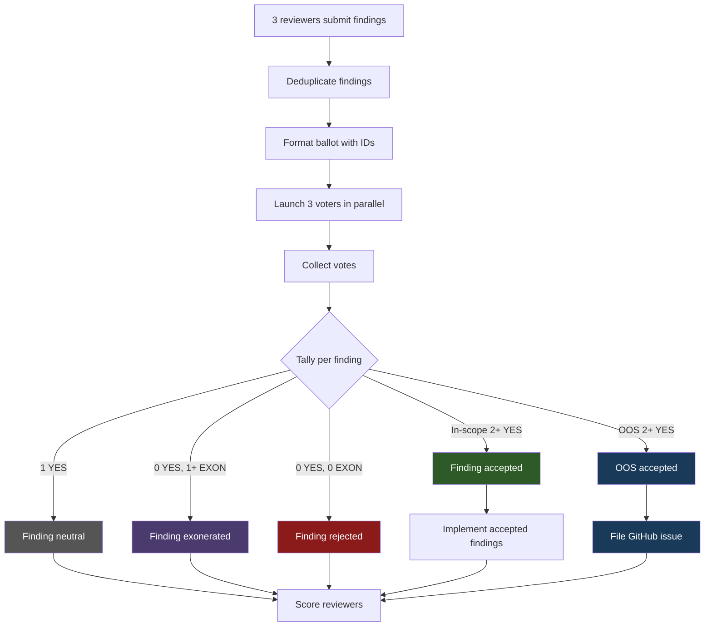

# Voting Process

Voting protocol used by `/design` (plan review) and `/review` (code review) to adjudicate findings. Replace older Negotiation Protocol for these skills. (`/research` and `/loop-review` still use Negotiation Protocol.)

## Overview

After reviewers submit findings and dedup, **3-agent voting panel** vote each finding. Each voter cast one of three votes:

| Vote | Meaning |
|---|---|
| **YES** | Finding correct, important, worth implementing. |
| **NO** | Finding wrong, trivial, or do more harm than good. |
| **EXONERATE** | Finding legit concern but not worth implementing this PR. Spare proposer from losing point on in-scope findings (OOS rejection no penalty anyway — see [Out-of-Scope Observations](#out-of-scope-observations)). |

## Threshold Rules

YES votes needed depend on voters available:

| Eligible Voters | YES Votes Required | Notes |
|---|---|---|
| 3 | 2+ | Standard majority |
| 2 | 2 (unanimous) | One voter unavailable or timeout |
| 1 | Skip voting | All findings auto-accept |
| 0 | Skip voting | All findings auto-accept |

## Voter Panel Composition

All tools available → panel 3 voters. Claude voter = same unified Code Reviewer subagent both skills:

| Skill | Voter 1 (Claude) | Voter 2 | Voter 3 |
|---|---|---|---|
| `/design` (plan review) | Claude Code Reviewer subagent | Codex | Cursor |
| `/review` (code review) | Claude Code Reviewer subagent | Codex | Cursor |

All voters vote all findings — no self-voting exclusion. Voters judge each finding on merit regardless of proposer.

## Ballot Format

Before voting, each deduped finding get stable sequential ID. Ballot format:

```text
FINDING_1: <reviewer attribution> — <finding description>
FINDING_2: <reviewer attribution> — <finding description>
```

OOS observations included same ballot with `[OUT_OF_SCOPE]` prefix:

```text
OOS_1: [OUT_OF_SCOPE] Code — <description of pre-existing issue>
```

## Voter Output Format

Each voter output one line per finding:

```text
FINDING_1: YES — <one-line rationale>
FINDING_2: NO — <one-line rationale>
FINDING_3: EXONERATE — <one-line rationale>
```

## Voting Flow



## Out-of-Scope Observations

Reviewers may surface **out-of-scope (OOS) observations** — pre-existing issues or concerns beyond PR scope. Handled same ballot as in-scope but different vote semantics and outcomes:

- OOS items on ballot with `[OUT_OF_SCOPE]` prefix
- **YES** on OOS = "deserves GitHub issue for future attention"
- **NO** = "not worth tracking"
- **EXONERATE** = "legit observation but not worth filing issue"
- OOS item get 2+ YES → **accepted**, filed as GitHub issue by `/implement`
- Non-accepted OOS collected and reported in PR body for future attention
- **OOS items never implemented in current PR** — accepted items → issue creation only
- OOS scoring asymmetric: accepted OOS earn +1 (like in-scope), rejected/exonerated OOS score 0 — no penalty (see [Point Competition](point-competition.md)). Mermaid chart above `REJECT → SCORE` path apply -1 only to in-scope findings; rejected OOS route through same `SCORE` node but contribute 0 points.

Only Claude subagent reviewers produce OOS observations (via dual-list output format). External reviewers (Codex, Cursor) produce single-list output treated fully as in-scope.

## Connection to Other Protocols

- **Voting Protocol** used by `/design` and `/review` — see this doc
- **Negotiation Protocol** used by `/research` and `/loop-review` — up to N rounds back-and-forth with external reviewers, Claude make final call
- **Dialectic Protocol** used by `/design` Step 2a.5 only — see [Relationship to Dialectic Protocol](#relationship-to-dialectic-protocol) below
- Key difference: voting = democratic panel with threshold rules; negotiation = bilateral dialogue with Claude as arbiter; dialectic = adjudicate binary debater defenses

See [Point Competition](point-competition.md) for how voting outcomes map to reviewer scores.

## Relationship to Dialectic Protocol

`/design` Step 2a.5 run separate protocol — **dialectic adjudication** — to resolve contested design decisions. Protocol **structurally parallel to voting-protocol but semantically independent**. Canonical spec live in [`skills/shared/dialectic-protocol.md`](../skills/shared/dialectic-protocol.md).

### Do not reuse voting-protocol parsers, thresholds, or scoring for dialectic

Maintainers extend Step 2a.5 MUST NOT reuse this doc's ballot parser, threshold tables, or scoring rules for dialectic. Two protocols differ every surface:

| Surface | Voting Protocol | Dialectic Protocol |
|---|---|---|
| Ballot ID prefix | `FINDING_N` (and `OOS_N` for out-of-scope) | `DECISION_N` |
| Vote tokens | `YES` / `NO` / `EXONERATE` | `THESIS` / `ANTI_THESIS` (binary — no third option) |
| Accept threshold (3 voters) | 2+ YES | 2+ same-side |
| Scoring | Reviewer competition scoreboard (+1 / 0 / -1) | **No scoring** (dialectic not competition) |
| OOS semantics | In-scope vs `[OUT_OF_SCOPE]` prefix; asymmetric reward-only for OOS | No OOS concept — every decision binding or synthesis-falls-back |

### Mechanical "no Claude debaters" rule (debate execution only)

Dialectic protocol diverge from repo-wide "replacement-first" fallback architecture **for debate phase only**: when assigned external debater tool (Cursor for odd-indexed decisions, Codex for even) unavailable, bucket **skipped entirely** and `Disposition: bucket-skipped` resolution written — Claude Code Reviewer subagents **never** substituted into debate path. Intentional (see GitHub issue #98 for rationale): debaters produce adversarial arguments where model-specific writing style could encode tool identity and bias downstream judge panel.

**Judge panel** (post-debate adjudication, always 3 slots) use repo-wide replacement-first pattern normally: Cursor or Codex unhealthy → Claude Code Reviewer subagent replace that slot so panel always stay at 3. Judges only adjudicate between pre-authored defenses; "no Claude substitution" rule specific to adversarial debate, not adjudication.
