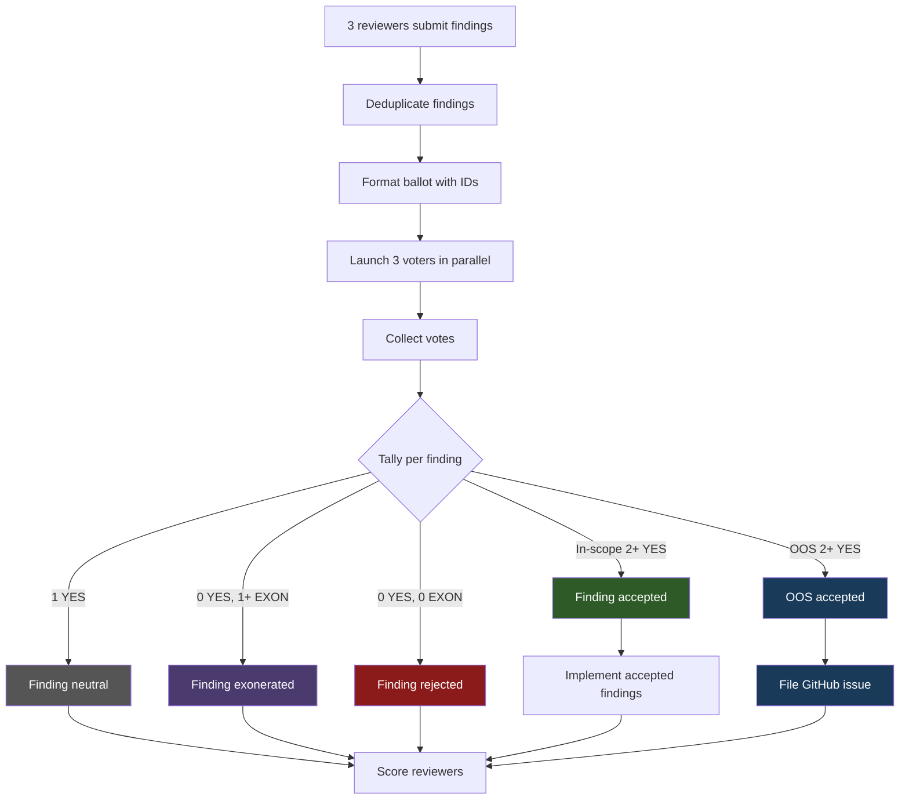

# Voting Process

The voting protocol is used by `/design` (plan review) and `/review` (code review) to adjudicate review findings. It replaces the older Negotiation Protocol for these skills. (`/research` and `/loop-review` continue using the Negotiation Protocol; `/research` with `--adjudicate` runs an additional dialectic-adjudication layer over post-merge orchestrator-rejected findings — see [`skills/research/references/adjudication-phase.md`](../skills/research/references/adjudication-phase.md) and [`skills/shared/dialectic-protocol.md`](../skills/shared/dialectic-protocol.md).)

## Overview

After reviewers submit findings and findings are deduplicated, a **3-agent voting panel** votes on each finding. Each voter casts one of three votes:

| Vote | Meaning |
|---|---|
| **YES** | The finding is correct, important, and worth implementing. |
| **NO** | The finding is incorrect, trivial, or would cause more harm than good. |
| **EXONERATE** | The finding raises a legitimate concern, but is not worth implementing in this PR. Spares the proposing reviewer from losing a point on in-scope findings (OOS rejection carries no penalty regardless — see [Out-of-Scope Observations](#out-of-scope-observations)). |

## Threshold Rules

The number of YES votes required depends on how many voters are available:

| Eligible Voters | YES Votes Required | Notes |
|---|---|---|
| 3 | 2+ | Standard majority |
| 2 | 2 (unanimous) | When one voter is unavailable or timed out |
| 1 | Skip voting | All findings accepted automatically |
| 0 | Skip voting | All findings accepted automatically |

## Voter Panel Composition

When all tools are available, the panel has 3 voters. The Claude voter is the same unified Code Reviewer subagent for both skills:

| Skill | Voter 1 (Claude) | Voter 2 | Voter 3 |
|---|---|---|---|
| `/design` (plan review) | Claude Code Reviewer subagent | Codex | Cursor |
| `/review` (code review) | Claude Code Reviewer subagent | Codex | Cursor |

All voters vote on all findings — there is no self-voting exclusion. Voters evaluate each finding on its merits regardless of who proposed it.

## Ballot Format

Before voting, each deduplicated finding receives a stable sequential ID. The ballot is formatted as:

```text
FINDING_1: <reviewer attribution> — <finding description>
FINDING_2: <reviewer attribution> — <finding description>
```

Out-of-scope observations are included on the same ballot with an `[OUT_OF_SCOPE]` prefix:

```text
OOS_1: [OUT_OF_SCOPE] Code — <description of pre-existing issue>
```

## Voter Output Format

Each voter outputs one line per finding:

```text
FINDING_1: YES — <one-line rationale>
FINDING_2: NO — <one-line rationale>
FINDING_3: EXONERATE — <one-line rationale>
```

## Voting Flow



## Out-of-Scope Observations

Reviewers may surface **out-of-scope (OOS) observations** — pre-existing issues or concerns beyond the PR's scope. These are handled alongside in-scope findings on the same ballot but with different vote semantics and outcomes:

- OOS items are included on the ballot with the `[OUT_OF_SCOPE]` prefix
- **YES** on an OOS item means "this deserves a GitHub issue for future attention"
- **NO** means "not worth tracking"
- **EXONERATE** means "legitimate observation but not worth filing an issue"
- If an OOS item receives 2+ YES votes, it is **accepted** and filed as a GitHub issue by `/implement`
- Non-accepted OOS items are collected and reported in the PR body for future attention
- **OOS items are never implemented in the current PR** — accepted items result in issue creation only
- OOS scoring is asymmetric: accepted OOS earns +1 (like in-scope findings), but rejected or exonerated OOS scores 0 — no penalty (see [Point Competition](point-competition.md)). The mermaid chart above's `REJECT → SCORE` path applies -1 only to in-scope findings; rejected OOS routes through the same `SCORE` node but contributes 0 points.

Claude subagent reviewers always produce OOS observations (via their dual-list output format). External reviewers (Codex, Cursor) **in diff mode** produce single-list output treated entirely as in-scope; **in `/review` slice mode**, external reviewers produce dual-list output matching the Claude subagent contract and contribute OOS observations via voting (see [skills/review/SKILL.md](../skills/review/SKILL.md) Step 3a).

## Connection to Other Protocols

- **Voting Protocol** is used by `/design` and `/review` — see this document
- **Negotiation Protocol** is used by `/research` and `/loop-review` — up to N rounds of back-and-forth with external reviewers, where Claude makes the final call
- **Dialectic Protocol** is used by `/design` Step 2a.5 (contested design decisions) and `/research` Step 2.5 (when `--adjudicate` is set, over orchestrator-rejected reviewer findings) — see [Relationship to Dialectic Protocol](#relationship-to-dialectic-protocol) below
- The key difference: voting uses a democratic panel with threshold rules; negotiation uses bilateral dialogue with Claude as arbiter; dialectic adjudicates binary debater defenses

See [Point Competition](point-competition.md) for how voting outcomes translate to reviewer scores.

## Relationship to Dialectic Protocol

`/design` Step 2a.5 runs a separate protocol — **dialectic adjudication** — to resolve contested design decisions. This protocol is **structurally parallel to voting-protocol but semantically independent**. The canonical specification lives in [`skills/shared/dialectic-protocol.md`](../skills/shared/dialectic-protocol.md).

### Do not reuse voting-protocol parsers, thresholds, or scoring for dialectic

Maintainers extending Step 2a.5 MUST NOT reuse this document's ballot parser, threshold tables, or scoring rules for dialectic. The two protocols differ on every surface:

| Surface | Voting Protocol | Dialectic Protocol |
|---|---|---|
| Ballot ID prefix | `FINDING_N` (and `OOS_N` for out-of-scope) | `DECISION_N` |
| Vote tokens | `YES` / `NO` / `EXONERATE` | `THESIS` / `ANTI_THESIS` (binary — no third option) |
| Accept threshold (3 voters) | 2+ YES | 2+ same-side |
| Scoring | Reviewer competition scoreboard (+1 / 0 / -1) | **No scoring** (dialectic is not a competition) |
| OOS semantics | In-scope vs `[OUT_OF_SCOPE]` prefix; asymmetric reward-only for OOS | No OOS concept — every decision is binding or synthesis-falls-back |

### Mechanical "no Claude debaters" rule (debate execution only)

The dialectic protocol diverges from the repo-wide "replacement-first" fallback architecture **for the debate phase only**: when an assigned external debater tool (Cursor for odd-indexed decisions, Codex for even) is unavailable, the bucket is **skipped entirely** and a `Disposition: bucket-skipped` resolution is written — Claude Code Reviewer subagents are **never** substituted into the debate path. This is intentional (see GitHub issue #98 for the rationale): debaters produce adversarial arguments where model-specific writing style could encode tool identity and bias the downstream judge panel.

The **judge panel** (post-debate adjudication, always 3 slots) uses the repo-wide replacement-first pattern normally: when Cursor or Codex is unhealthy, a Claude Code Reviewer subagent replaces that slot so the panel always remains at 3. Judges only adjudicate between pre-authored defenses; the "no Claude substitution" rule is specific to adversarial debate, not to adjudication.
