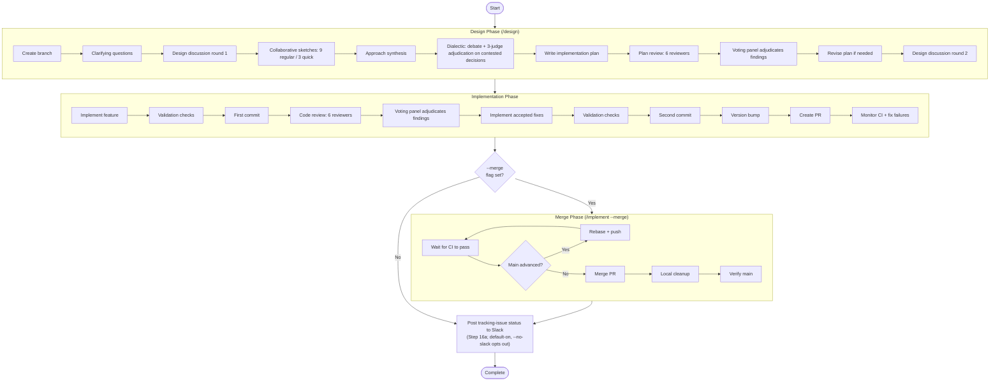

# Workflow Lifecycle

How skills compose to form the end-to-end development workflow in Larch.

## Skill Orchestration Hierarchy

Skills are not invoked in a flat sequence. They form a hierarchical call graph where higher-level **stateful orchestrators** invoke lower-level skills and continue execution based on their side effects. The diagram below shows only true orchestrators and their direct sub-skills; pure forwarders (`/im`, `/imaq`, `/create-skill`, `/simplify-skill`, `/compress-skill`) are covered separately in the [Delegation Topology](#delegation-topology) subsection below because they run no post-delegation logic. `/alias` is a hybrid (validate → delegate → verify) — it also appears in the Delegation Topology subsection.

```mermaid
graph TD
    IMPLEMENT["/implement"] -->|invokes| DESIGN["/design"]
    IMPLEMENT -->|invokes| REVIEW["/review"]
    IMPLEMENT -->|invokes| CHECKS["/relevant-checks"]
    IMPLEMENT -->|invokes| BUMP["/bump-version"]
    IMPLEMENT -->|invokes| ISSUE_OOS["/issue (OOS filing)"]
    FIX["/fix-issue"] -->|invokes| IMPLEMENT
    EVOLVER["/skill-evolver"] -->|invokes| RESEARCH["/research"]
    EVOLVER -->|invokes (conditional)| UMBRELLA["/umbrella"]
    UMBRELLA -->|invokes| ISSUE

    style IMPLEMENT fill:#2d5a27,color:#fff
    style FIX fill:#2d5a27,color:#fff
    style EVOLVER fill:#2d5a27,color:#fff
    style DESIGN fill:#4a3a6e,color:#fff
    style REVIEW fill:#4a3a6e,color:#fff
    style RESEARCH fill:#4a3a6e,color:#fff
    style UMBRELLA fill:#555,color:#fff
    style CHECKS fill:#555,color:#fff
    style BUMP fill:#555,color:#fff
    style ISSUE fill:#555,color:#fff
    style ISSUE_OOS fill:#555,color:#fff
```

- **`/implement`** — top-level orchestrator. Runs the full design → code → review → PR workflow by default. With the `--merge` flag, also runs the CI+rebase+merge loop and local cleanup after PR creation. Step 0.5 resolves tracking-issue state (sentinel reuse, `--issue <N>` adoption, or `Closes #<N>` recovery from the current branch's PR body); the tracking issue's anchor comment is the single source of truth for full report content (voting tallies, rejected findings, version-bump reasoning, diagrams, OOS observation links, execution issues, run statistics), with the PR body as a slim projection (Summary + diagrams + Test plan + `Closes #<N>` — diagrams appear in both places by design). Step 9a.1 additionally invokes `/issue` in batch mode to file accepted OOS findings as GitHub issues; when Step 0.5 took Branch 4 (no sentinel, no `--issue`, no `Closes #<N>` recovery), the tracking issue is first created at Step 9a.1. See `skills/implement/SKILL.md` Step 0.5 Branches 1-4 for the full adoption-vs-creation flow.
- **`/fix-issue`** — processes one approved GitHub issue per invocation. Step 0 (`find-lock-issue.sh`) atomically finds an eligible candidate (open, with `GO` sentinel comment as last comment, no managed lifecycle title prefix, not already locked, no open blockers), acquires the comment lock, and renames the title to `[IN PROGRESS]` immediately on lock so the visual lifecycle reflects the active run without a multi-minute delay. Triages, and classifies intent (PR/NON_PR) and — for PR tasks — complexity (SIMPLE/HARD). PR tasks delegate to `/implement` with mode-appropriate flags (`--quick` for SIMPLE, full for HARD; always `--merge`) and forward `--issue $ISSUE_NUMBER` so the queue issue is adopted as the tracking issue (no separate tracking issue is created); NON_PR tasks run inline (typically filing findings via `/issue`) and never call `/implement`. **Umbrella support (explicit-target only)**: `/fix-issue <umbrella#>` accepts an umbrella issue (detected post-#846 by title-only — title prefix `Umbrella:` / `Umbrella —` after stripping leading bracket-blocks per #819; body content is NOT consulted) and dispatches to the next eligible child without requiring `GO` on either the umbrella or the chosen child; auto-pick mode (no positional argument) NEVER selects umbrellas. When the umbrella's last open child closes, the umbrella is automatically renamed to `[DONE]` and closed.
- **`/skill-evolver`** — research-and-file-issues orchestrator targeting an existing skill. Validates `<skill-name>` (regex + plugin-repo CWD + target SKILL.md exists at `skills/<name>/` or `.claude/skills/<name>/`) via `skills/skill-evolver/scripts/validate-args.sh`, then invokes `/research --no-issue --scale=deep` with a templated prompt that asks the lane fan-out (5 research lanes + 5 validation lanes) to identify concrete actionable improvements with citations — repo-local sibling-skill `file:line` references plus reputable external sources (Anthropic / OpenAI / DeepMind / ≥500-star OSS). On `≥1` improvement, distills the findings into a task description and delegates to `/umbrella` with `--label evolved-by:skill-evolver --label skill:<name> --title-prefix "[skill-evolver:<name>] "`. `/umbrella`'s own classifier decides one-shot (single issue, no umbrella) vs multi-piece (umbrella + one child per piece — very small items may be bundled into a single composed piece per Step 3B.1's bundling rule) on the distilled description — `/skill-evolver` does not pre-commit to the final shape. The label and title-prefix tag whatever `/umbrella` files for later filtering. On `0` improvements, exits cleanly without filing. The skill itself does NOT modify the target skill's files — implementation lands later via `/fix-issue` (per child). Stateful orchestrator: NOT a pure forwarder (post-`/research` decision logic + conditional `/umbrella` invocation) and therefore subject to the post-invocation-verification + anti-halt-continuation rules.

## Delegation Topology

Pure forwarders are **not** orchestrators — they validate input (when applicable), call the Skill tool exactly once, and exit. They run no logic after the child returns. This subsection also documents `/alias`, which is a hybrid: it validates, delegates to `/implement`, and then performs a mechanical sentinel-file verification (see `/alias` Step 4). Edges are labeled with the **arguments passed on that edge** (what the immediate child receives), not the final expansion — for single-hop delegation (`/im`, `/imaq`, `/alias`) this is also what `/implement` sees, but for the two-hop chains `/create-skill → /im → /implement` and `/compress-skill → /imaq → /implement`, the first edge shows only what the intermediate forwarder receives; the forwarder then prepends its own flags (`/im` adds `--merge`; `/imaq` adds `--merge --auto --quick`) before `/implement` sees the final expansion.

```mermaid
graph LR
    CREATE["/create-skill"] -->|--quick --auto| IM
    SIMPLIFY["/simplify-skill"] -->|$ARGS (feature-desc)| IM
    COMPRESS["/compress-skill"] -->|$ARGS (feature-desc)| IMAQ
    IM["/im"] -->|--merge $ARGS| IMPLEMENT["/implement"]
    IMAQ["/imaq"] -->|--merge --auto --quick $ARGS| IMPLEMENT
    ALIAS["/alias"] -->|--quick --auto $ARGS| IMPLEMENT

    style CREATE fill:#6b4c2a,color:#fff
    style SIMPLIFY fill:#6b4c2a,color:#fff
    style COMPRESS fill:#6b4c2a,color:#fff
    style IM fill:#6b4c2a,color:#fff
    style IMAQ fill:#6b4c2a,color:#fff
    style ALIAS fill:#6b4c2a,color:#fff
    style IMPLEMENT fill:#2d5a27,color:#fff
```

- **`/im`** — prepends `--merge` to `$ARGUMENTS` and forwards to `/implement`. Equivalent to `/implement --merge <args>`.
- **`/imaq`** — prepends `--merge --auto --quick`. Equivalent to `/implement --merge --auto --quick <args>`.
- **`/alias`** — hybrid: validates alias name, delegates to `/implement --quick --auto` to scaffold a new alias skill, then performs a sentinel-file verification (Step 4) that the expected `SKILL.md` was actually written. Auto-resolves the target directory: inside a Claude plugin source repo (two-file predicate `.claude-plugin/plugin.json` + `skills/implement/SKILL.md` at the git repo root) the alias goes under `skills/<n>/`; anywhere else, under `.claude/skills/<n>/`. Accepts optional `--merge` to merge the alias-creation PR and `--private` to force `.claude/skills/<n>/` even in a plugin repo (no-op in non-plugin repos).
- **`/create-skill`** — validates name + description, then delegates to `/im --quick --auto` (which expands to `/implement --merge --quick --auto`) to scaffold a new larch-style skill. Auto-merge is the default. Accepts `--merge` as a backward-compat no-op. `/create-skill --plugin` writes under `skills/`; default is `.claude/skills/<name>/`. The scaffold process also emits a post-scaffold doc-sync checklist via `skills/create-skill/scripts/post-scaffold-hints.sh` — reminders to update the README catalog, `.claude/settings.json` permissions, this file (`docs/workflow-lifecycle.md`), and (when applicable) `docs/agents.md`, `docs/review-agents.md`, and `AGENTS.md` canonical sources.
- **`/simplify-skill`** — accepts a single target-skill name (bare form; `/` prefix tolerated), resolves the target directory (plugin tree first, then consumer `.claude/skills/`, then `${CLAUDE_PLUGIN_ROOT}/.claude/skills/`), enumerates every `.md` file physically under that directory (excluding `scripts/` and `tests/`), and delegates a pinned behavior-preserving refactor feature description to `/im` (which expands to `/implement --merge`). Sub-skills invoked via the `Skill` tool are out of scope by construction (they live in sibling `skills/OTHER/` directories so never appear in the find output). `skills/shared/*.md` is out of scope by policy (cross-skill blast radius — refactor separately). The feature description requires a `## Token budget` section in the PR body tracking SKILL.md line/char deltas. Helper script: `skills/simplify-skill/scripts/build-feature-description.sh` (fail-closed on bad name / not found).
- **`/compress-skill`** — pure forwarder. Resolves the target skill directory, enumerates the transitively-reachable `.md` set inside it, snapshots baseline byte/line counts, and delegates a behavior-preserving prose-rewrite feature description to `/imaq` (which expands to `/implement --merge --auto --quick`) so changes ship as an auto-merged PR. See the Standalone Usage entry for full scope rules and the `## Token budget` PR-body contract.

Pure forwarders (`/im`, `/imaq`, `/create-skill`, `/simplify-skill`, `/compress-skill`) are exempt from the post-invocation-verification and anti-halt-continuation rules defined in `skills/shared/subskill-invocation.md`. `/alias` is NOT exempt — it carries both the post-invocation sentinel check and the anti-halt banner/micro-reminder. See that document for the full classification rules.

## End-to-End Flow

The full lifecycle when running `/implement <feature description>`:



## Standalone Usage

Not every task requires the full `/implement` pipeline. Skills can be used independently:

- **`/design [--auto] [--quick] [--debug] <feature>`** — Plan a feature without implementing it. Creates a branch, runs collaborative sketches (9 agents in regular mode, 3 in quick mode), writes and reviews the plan with a 6-reviewer panel + voting.
- **`/review [--diff] [--no-issues] [--debug] [<description>]`** — Two modes: `--diff` reviews the current branch's changes (implements accepted fixes in a recursive loop); positional `<description>` reviews existing code and files accepted findings as GitHub issues by default (`--no-issues` to suppress).
- **`/research [--debug] [--plan] [--interactive] [--scale=quick|standard|deep] [--adjudicate] [--keep-sidecar[=PATH]] [--token-budget=N] [--no-issue] <topic>`** — Best-effort read-only-repo investigation, scale-aware. **Adaptive scaling is the default**: a deterministic shell classifier picks `quick|standard|deep` from the question at Step 0.5; `--scale=` is a manual override; classifier failure falls back to `standard`. **Step 2.7 (citation validation, unconditional, issue #516)** runs between Step 2.5 and Step 3 on every scale: a deterministic shell validator extracts cited URLs / DOIs / file:line references from the synthesis, HEAD-fetches URLs under SSRF guards, validates DOIs, spot-checks file:line ranges against the git tree, and writes a 3-state ledger (PASS / FAIL / UNKNOWN) sidecar that Step 3 splices into the final report — fail-soft (the report is never blocked). **Standard scale** runs 3 research agents (Cursor + Codex + Claude inline) **angle-differentiated per lane** (Cursor → architecture, Codex → edge cases by default or external comparisons when `external_evidence_mode=true`, Claude inline → security) + 3-reviewer validation panel. `--scale=quick` runs **K=3 homogeneous Claude Agent-tool lanes with vote-merge synthesis** (issue #520 — evolved from 1 inline lane; each carrying `RESEARCH_PROMPT_BASELINE`) and skips Step 2 (the validation panel) — the final report still renders a 0-reviewer Validation phase placeholder line (fastest, K-lane voting confidence — explicit lower-assurance mode; the synthesis carries a "K-lane voting confidence" disclaimer naming correlated-error risk; partial failure with 1 surviving lane falls back to the existing "single-lane confidence" disclaimer). `--scale=deep` runs 5 research lanes (Claude inline running baseline `RESEARCH_PROMPT_BASELINE` + 2 Cursor + 2 Codex with diversified angle prompts — architecture / edge cases / external comparisons / security) + 5-reviewer validation panel (the standard 3 + 2 extra Claude Code Reviewer subagents with `Code-Sec` / `Code-Arch` lane-local emphasis — NOT new agent slugs). Optional `--plan` (supported with `--scale=standard` or `--scale=deep`) inserts a planner pre-pass that decomposes the question into 2–4 focused subquestions and assigns them to the per-scale lanes — 3 standard lanes (each subquestion inherits its lane's angle perspective) or 5 deep lanes (balanced partial-matrix ring rotation across the 4 named-angle slots plus a Claude-inline integrator). Synthesis is organized by subquestion (deep mode also adds a Per-angle highlights sub-section + Cross-cutting findings sub-section). Falls back cleanly to single-question mode on planner failure. `--plan` is downgraded with a warning under `--scale=quick` (K homogeneous Claude lanes, no per-angle differentiation → no decomposition benefit). Optional `--interactive` (requires `--plan`; hard-fails on non-TTY before the planner runs) pauses after the planner so the operator can review, edit, or abort the proposed subquestions before lane fan-out. Does not create branches or make commits. The skill-scoped `scripts/deny-edit-write.sh` PreToolUse hook mechanically guards Claude's `Edit`/`Write`/`NotebookEdit` tool surface, permitting only paths under canonical `/tmp`; **the hook does not cover Bash or external reviewers** (Cursor/Codex launch directly against `$PWD` with full filesystem access — non-modification is prompt-enforced only). See [`SECURITY.md` § External reviewer write surface in /research](../SECURITY.md#external-reviewer-write-surface-in-research) for the full residual-risk framing. Step 3.5 auto-archives the full report as a GitHub issue on each successful run (via `/issue` single mode); `--no-issue` skips this step. May also invoke `/issue` via the Skill tool when the research brief calls for filing findings as issues.
- **`/fix-issue [--debug] [--no-slack] [--no-admin-fallback] [<number-or-url>]`** — Process one approved GitHub issue per invocation. Step 0 atomically finds + locks + renames title to `[IN PROGRESS]`. Triages, classifies intent (PR/NON_PR) and — for PR tasks — complexity (SIMPLE/HARD). PR tasks delegate to `/implement` with `--issue $ISSUE_NUMBER` forwarded (so the queue issue is adopted as the tracking issue — no separate tracking issue is created) and `--no-slack` / `--no-admin-fallback` propagated when set so the delegated `/implement` run does NOT post to Slack and / or bails to Step 12d on branch-protection denial; NON_PR tasks run inline and never call `/implement` — their own Step 7 Slack announcement also honors `--no-slack`. Single-iteration; caller handles repetition.
- **`/alias [--merge] [--no-slack] [--private] <name> <skill> [flags...]`** — Create an alias skill that forwards to a larch skill with preset flags. **Target directory** is auto-resolved: inside a Claude plugin source repo (two-file predicate: `.claude-plugin/plugin.json` AND `skills/implement/SKILL.md` at the git repo root, matching `validate-args.sh:133`), the alias is generated under `skills/<n>/SKILL.md` (exported plugin skill); anywhere else, under `.claude/skills/<n>/SKILL.md` (dev-only repo-private). `--private` forces `.claude/skills/<n>/` even inside a plugin repo (escape hatch); in non-plugin repos `--private` is a no-op. Delegates to `/implement --quick --auto` for the full pipeline (code review, version bump, PR). `--merge` also merges the PR after CI passes. `--no-slack` (when placed before the first positional) forwards to `/implement` so the alias-creation run does NOT post to Slack; `--no-slack` placed after the first positional is passed through verbatim as a preset flag for the generated alias. Same dual-role rule applies to `--private`.
- **`/create-skill [--plugin] [--multi-step] [--merge] [--debug] [--no-slack] <name> <desc>`** — Scaffold a new larch-style skill. Validates inputs, delegates to `/im --quick --auto` (auto-merges by default; forwards `--no-slack` so the scaffold run does NOT post a Slack announcement when set). See [Delegation Topology](#delegation-topology) above for the full chain and post-scaffold sync obligations.
- **`/simplify-skill [--debug] [--no-slack] <skill-name>`** — Refactor an existing skill for stronger adherence to `skills/shared/skill-design-principles.md` and reduced SKILL.md token footprint. Resolves the target, enumerates in-scope `.md` files (excludes `scripts/`, `tests/`, `skills/shared/`, and sub-skills invoked via the `Skill` tool), and delegates a behavior-preserving refactor to `/im` (forwards `--no-slack` so the refactor run does NOT post a Slack announcement when set). PR body includes a `## Token budget` section.
- **`/compress-skill [--debug] [--no-slack] <skill-name-or-path>`** — Rewrite an existing skill's Markdown prose to reduce size while preserving meaning. Discovers the transitively included `.md` set (BFS from `SKILL.md` following both Markdown links and backticked `${CLAUDE_PLUGIN_ROOT}/...`-style path citations, restricted to the skill's own directory tree), snapshots byte/line counts, and delegates a behavior-preserving prose rewrite to `/imaq` (forwards `--no-slack` so the compression run does NOT post a Slack announcement when set) applying Strunk & White's *Elements of Style* adapted for technical writing. Structural elements (YAML frontmatter, fenced code blocks, headings, link targets, inline code, file paths, numeric values, identifiers) are preserved verbatim; only prose is rewritten. PR body includes a `## Token budget` section with per-file before/after byte and line deltas.
- **`/skill-evolver [--debug] <skill-name>`** — Evolve an existing larch skill by researching concrete improvements and filing them as GitHub issues. Validates `<skill-name>` (regex + plugin-repo CWD + skill exists at `skills/<name>/` or `.claude/skills/<name>/`), invokes `/research --no-issue --scale=deep` against repo-local sibling skills + reputable external sources (Anthropic / OpenAI / DeepMind / ≥500-star OSS) for concrete actionable improvements with citations, and on `≥1` improvement delegates to `/umbrella` with `--label evolved-by:skill-evolver --label skill:<name> --title-prefix "[skill-evolver:<name>] "`. `/umbrella`'s classifier picks one-shot (single issue) vs multi-piece (umbrella + children — very small items may be bundled into a single composed piece per `/umbrella` Step 3B.1's bundling rule) on the distilled description. On `0` improvements, exits cleanly without filing. Research-and-file-issues only — does not modify the target skill's files; implementation lands later via `/fix-issue` (per child).
- **`/issue [--input-file F] [--title-prefix P] [--label L]... [--go] [<desc>]`** — Create one or more GitHub issues with 2-phase LLM-based semantic duplicate detection.

Shortcut aliases (covered in [Delegation Topology](#delegation-topology)):
- **`/im <args>`** ≡ `/implement --merge <args>`
- **`/imaq <args>`** ≡ `/implement --merge --auto --quick <args>`

## Flags

Flags modify behavior across the skill hierarchy:

| Flag | Available on | Effect |
|---|---|---|
| `--quick` | `/implement` | Skips `/design` (produces inline plan instead). Simplifies code review to a single-reviewer loop of up to 7 rounds with a per-round Cursor → Codex → Claude Code Reviewer subagent fallback chain (no voting panel). |
| `--auto` | `/implement`, `/design` | Suppresses all interactive question checkpoints. Skills run fully autonomously without user interaction. |
| `--merge` | `/implement` | Runs the CI+rebase+merge loop, local branch cleanup, and main verification after PR creation. Without `--merge`, `/implement` creates the PR and stops after the initial CI wait; the final Step 16a Slack issue post still runs in both cases (gated on Slack env vars + `--no-slack`). |
| `--no-slack` | `/implement`, `/fix-issue`, `/simplify-skill`, `/compress-skill`, `/create-skill`, `/alias` (plus aliases generated by `/alias` — `$ARGUMENTS` passthrough lets `--no-slack` flow through `/im`, `/imaq`, and other forwarders to `/implement`) | Suppresses the default-on Slack post. On `/implement`, Step 16a posts a single tracking-issue status message near end-of-run (✅ closed / 📝 PR opened / ❌ blocked / ❓ needs user input) as the git user (`git config user.name` → Slack `username`); requires `LARCH_SLACK_BOT_TOKEN` and `LARCH_SLACK_CHANNEL_ID`. Default behavior (no `--no-slack`) posts when env vars are configured; `--no-slack` opts out. Every downstream skill accepts `--no-slack` and forwards it to its `/implement` (or `/im` / `/imaq`) invocation. |
| `--debug` | `/implement`, `/design`, `/review`, `/research` | Enables verbose output: descriptive Bash tool descriptions, full explanatory prose between tool calls, per-reviewer individual completion messages alongside the compact status table. Default (no `--debug`) uses minimal output with compact status tables and suppressed prose. `/implement` auto-propagates `--debug` to `/design` and `/review`. |
| `--scale=quick\|standard\|deep` | `/research` | Manual override of the adaptive-scaling default. When omitted, the deterministic shell classifier at Step 0.5 picks the bucket from the question text; on classifier failure `RESEARCH_SCALE` falls back to `standard`. When provided, the classifier is skipped entirely. Buckets: `standard` (3+3 lanes; angle-differentiated per lane — Cursor → architecture, Codex → edge cases or external comparisons, Claude inline → security). `quick` runs K=3 homogeneous Claude Agent-tool lanes with vote-merge synthesis (issue #520; each carrying `RESEARCH_PROMPT_BASELINE`) and skips Step 2 (validation panel) — the report still renders a 0-reviewer Validation phase placeholder line (fastest, K-lane voting confidence — explicit lower assurance). `deep` runs 5+5 lanes with the four diversified angle prompts (architecture / edge cases / external comparisons / security) plus a baseline Claude inline lane and 2 extra Claude code-reviewer subagents in validation. Independent of `--debug`. |
| `--plan` | `/research` | Enables the planner pre-pass before the lane fan-out: a single Claude Agent subagent decomposes the question into 2–4 focused subquestions, lanes research their assigned subquestion(s), and synthesis is organized by subquestion + a final cross-cutting findings sub-section (deep mode also adds a per-angle highlights sub-section). Falls back cleanly to single-question mode on planner failure. Supported with `--scale=standard` (3 lanes; existing N-dependent assignment table — each subquestion inherits its lane's angle perspective) and `--scale=deep` (5 lanes; balanced partial-matrix ring rotation across the 4 named-angle slots plus a Claude-inline integrator — issue #519). Incompatible with `--scale=quick` (single lane → no decomposition benefit); the combination downgrades `--plan` to off with a visible warning. Default off — byte-equivalent to pre-#420 behavior on the no-`--plan` path. Independent of `--debug`. |
| `--interactive` | `/research` | Pauses Step 1.1 after the planner pre-pass so the operator can review the proposed 2–4 subquestions and either proceed (Enter), edit (`$EDITOR` or stdin fallback; one bounded retry on validation failure), or abort. Hard-fails BEFORE the planner runs when stdin is not a TTY (CI environments). Requires `--plan` — fails with a usage error if `--interactive` is set without `--plan`. Deep mode confirms only the subquestion list — the per-lane subq×angle pairing (Step 1.2 ring rotation) stays mechanical regardless. Becomes a no-op with a notice when `--scale=quick` auto-disables `--plan`. SIGINT (Ctrl-C) does NOT run the cleanup recipe; only typed `abort` does. Default off — byte-equivalent to pre-#522 behavior on the no-`--interactive` path. Independent of `--debug`. Issue #522. |
| `--adjudicate` | `/research` | Runs a 3-judge dialectic adjudication step (Step 2.5) over reviewer findings the orchestrator rejected during validation merge/dedup; majority binds, with reinstated findings folded into the validated synthesis before the report renders. Default off — Step 2.5 short-circuits when not set. Composes with any `--scale` (when `--scale=quick` skips Step 2 entirely there are no rejections to adjudicate and Step 2.5 short-circuits cleanly) and with `--plan`. Independent of `--debug`. |
| `--token-budget=N` | `/research` | Enforces a between-phase budget cap on measurable Claude subagent tokens (lanes whose Agent-tool return carries `<usage>total_tokens: N</usage>` — planner, fallback subagents, runtime-timeout replacements, validation Code/Code-Sec/Code-Arch lanes, adjudication judges). Claude inline (orchestrator) and external lanes (Cursor/Codex) are unmeasurable and excluded from the cap. On overage at any of three gates (after Steps 1, 2, 2.5), the run aborts before the next phase, skips Step 3 entirely, renders the partial token report at Step 4, and the completion line carries the `(aborted: budget exceeded)` suffix. Default unset (no enforcement). Step 4's `## Token Spend` section renders unconditionally regardless of `--token-budget`. Composes with any `--scale` (in `--scale=quick`, no measurable lanes exist so the cap is effectively a no-op). Independent of `--debug`. See `scripts/token-tally.md`. |

## Conditional Steps

Certain steps in the workflow depend on configuration prerequisites and are skipped when unavailable:

- **Slack announcements** — On by default when Slack configuration (`LARCH_SLACK_BOT_TOKEN` + `LARCH_SLACK_CHANNEL_ID`) is present. `/implement` Step 16a posts a single tracking-issue status message near the end of each run. Pass `--no-slack` to opt out. With missing env vars (and `--no-slack` not set), the step is skipped with a warning at session setup. The workflow continues in both cases.
- **CI monitoring** — Requires repository identification. When unavailable, CI monitoring is skipped.
- **Version bump** — Requires a `/bump-version` skill defined in the repo. When absent, the version bump step is skipped with a warning.
- **External reviewers (Cursor, Codex)** — When unavailable, Claude Code Reviewer subagent fallbacks replace them so the per-skill lane/voter counts remain constant in most phases (6 for `/design` plan review; 3 for `/implement` Phase 3 conflict review and `/research --scale=standard`; 1 for `/research --scale=quick`; 5 for `/research --scale=deep`; 9 for the `/design` sketch phase in regular mode, 3 in quick mode; 3 for voting panels; 3 for the `/design` dialectic judge panel). In `/review`, the fallback chain differs: Cursor down → Codex fills specialist slots; both down → 1 Claude generic (see [review-agents.md](review-agents.md)). The review still lands because the unified Code Reviewer archetype is what each fallback reviewer runs; losing the external tool means losing harness diversity but not coverage.
- **Dialectic debate buckets (`/design` Step 2a.5)** — Unlike the phases above, the dialectic **debate** phase does NOT replace an unavailable tool with a Claude subagent. When the assigned external tool (Cursor for odd-indexed decisions, Codex for even) is unavailable, the bucket is **skipped entirely** and a `Disposition: bucket-skipped` resolution is written (the synthesis decision stands for that point). This carve-out applies to debate execution only — the post-debate **judge panel** uses replacement-first normally. See [External Reviewers](external-reviewers.md#dialectic-specific-behavior) and `skills/shared/dialectic-protocol.md` for details.

## Resolution Protocols

Different skills use different protocols for resolving review findings:

| Protocol | Used by | Mechanism |
|---|---|---|
| [Voting](voting-process.md) | `/design`, `/review` (both diff and description modes) | 3-agent panel votes YES/NO/EXONERATE. 2+ YES required to accept. |
| Negotiation | `/research` | Up to N rounds of back-and-forth with external reviewers. Claude makes the final call. |

See [Voting Process](voting-process.md) for full details on the voting protocol.
