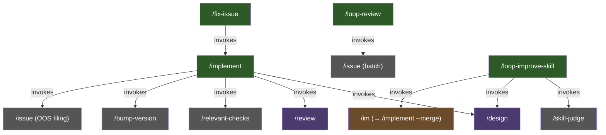
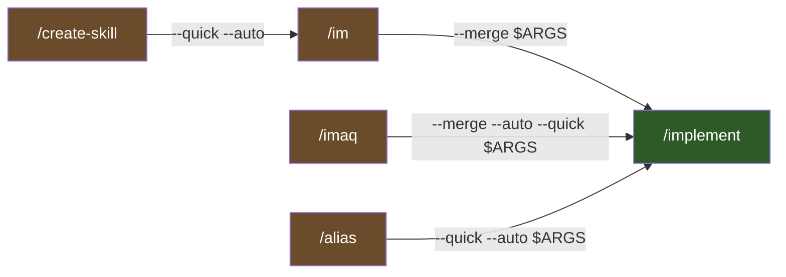

# Workflow Lifecycle

How skills compose to form the end-to-end development workflow in Larch.

## Skill Orchestration Hierarchy

Skills are not invoked in a flat sequence. They form a hierarchical call graph where higher-level **stateful orchestrators** invoke lower-level skills and continue execution based on their side effects. The diagram below shows only true orchestrators and their direct sub-skills; pure forwarders (`/im`, `/imaq`, `/create-skill`) are covered separately in the [Delegation Topology](#delegation-topology) subsection below because they run no post-delegation logic. `/alias` is a hybrid (validate → delegate → verify) — it also appears in the Delegation Topology subsection.

- **`/implement`** — top-level orchestrator. Runs the full design → code → review → PR workflow by default. With the `--merge` flag, also runs the CI+rebase+merge loop and local cleanup after PR creation. Step 9a.1 additionally invokes `/issue` in batch mode to file accepted OOS findings as GitHub issues.
- **`/loop-review`** — partitions the codebase into slices, reviews each with a 3-reviewer panel, and invokes `/issue` in batch mode to file every actionable finding as a deduplicated GitHub issue (labeled `loop-review`) — accumulating up to 3 slices per `/issue` invocation before flushing so `/issue`'s 2-phase LLM dedup runs once per batch. Security-tagged findings are held locally per SECURITY.md rather than auto-filed.
- **`/fix-issue`** — processes one approved GitHub issue per invocation. Fetches open issues with a `GO` sentinel comment, skips any with open blockers, triages against the codebase, classifies complexity (SIMPLE/HARD), and delegates to `/implement` with mode-appropriate flags (`--quick` for SIMPLE, full for HARD; always `--merge`).
- **`/loop-improve-skill`** — iteratively improves an existing skill. Creates a tracking GitHub issue, then runs up to 10 rounds of `/skill-judge` → post judgment → `/design` → (exit if no plan) → post plan → `/im`. Stops early when `/design` produces no improvement plan or after 10 iterations. `/skill-judge` comes from the skill-judge plugin; the loop references it by bare name with plugin-qualified fallback.

## Delegation Topology

Pure forwarders are **not** orchestrators — they validate input (when applicable), call the Skill tool exactly once, and exit. They run no logic after the child returns. This subsection also documents `/alias`, which is a hybrid: it validates, delegates to `/implement`, and then performs a mechanical sentinel-file verification (see `/alias` Step 4). Edges are labeled with the **arguments passed on that edge** (what the immediate child receives), not the final expansion — for single-hop delegation (`/im`, `/imaq`, `/alias`) this is also what `/implement` sees, but for the two-hop chain `/create-skill → /im → /implement`, the `CREATE→IM` edge shows only what `/im` receives; `/im` then prepends `--merge` so `/implement` sees `--merge --quick --auto <feature-desc>`.

- **`/im`** — prepends `--merge` to `$ARGUMENTS` and forwards to `/implement`. Equivalent to `/implement --merge <args>`.
- **`/imaq`** — prepends `--merge --auto --quick`. Equivalent to `/implement --merge --auto --quick <args>`.
- **`/alias`** — hybrid: validates alias name, delegates to `/implement --quick --auto` to scaffold a new project-level alias skill under `.claude/skills/`, then performs a sentinel-file verification (Step 4) that the expected `SKILL.md` was actually written. Accepts optional `--merge` to merge the alias-creation PR.
- **`/create-skill`** — validates name + description, then delegates to `/im --quick --auto` (which expands to `/implement --merge --quick --auto`) to scaffold a new larch-style skill. Auto-merge is the default. Accepts `--merge` as a backward-compat no-op. `/create-skill --plugin` writes under `skills/`; default is `.claude/skills/<name>/`. The scaffold process also emits a post-scaffold doc-sync checklist via `skills/create-skill/scripts/post-scaffold-hints.sh` — reminders to update the README catalog, `.claude/settings.json` permissions, this file (`docs/workflow-lifecycle.md`), and (when applicable) `docs/agents.md`, `docs/review-agents.md`, and `AGENTS.md` canonical sources.

Pure forwarders (`/im`, `/imaq`, `/create-skill`) are exempt from the post-invocation-verification and anti-halt-continuation rules defined in `skills/shared/subskill-invocation.md`. `/alias` is NOT exempt — it carries both the post-invocation sentinel check and the anti-halt banner/micro-reminder. See that document for the full classification rules.

## End-to-End Flow

The full lifecycle when running `/implement <feature description>`:

## Standalone Usage

Not every task requires the full `/implement` pipeline. Skills can be used independently:

- **`/design [--auto] [--debug] <feature>`** — Plan a feature without implementing it. Creates a branch, runs 5-agent collaborative sketches, writes and reviews the plan with a 3-reviewer panel + voting.
- **`/review [--debug]`** — Review the current branch's changes. Launches reviewers, runs voting on findings, implements accepted fixes, and re-runs validation checks in a recursive loop.
- **`/research [--debug] <topic>`** — Read-only investigation. Does not create branches, modify files, or make commits. Uses a restricted tool set (no Edit, Write, or Skill tools).
- **`/fix-issue [--debug] [<number-or-url>]`** — Process one approved GitHub issue per invocation. Triages, classifies SIMPLE/HARD, and delegates to `/implement`. Single-iteration; caller handles repetition.
- **`/loop-improve-skill <skill-name>`** — Iterate judge → plan → implement over an existing skill up to 10 rounds. Stops early if `/design` returns no plan.
- **`/alias [--merge] <name> <skill> [flags...]`** — Create a project-level alias skill in `.claude/skills/` that forwards to a larch skill with preset flags. Delegates to `/implement --quick --auto` for the full pipeline (code review, version bump, PR). `--merge` also merges the PR after CI passes.
- **`/create-skill [--plugin] [--multi-step] [--merge] [--debug] <name> <desc>`** — Scaffold a new larch-style skill. Validates inputs, delegates to `/im --quick --auto` (auto-merges by default). See [Delegation Topology](#delegation-topology) above for the full chain and post-scaffold sync obligations.
- **`/issue [--input-file F] [--title-prefix P] [--label L]... [--go] [<desc>]`** — Create one or more GitHub issues with 2-phase LLM-based semantic duplicate detection.

Shortcut aliases (covered in [Delegation Topology](#delegation-topology)):
- **`/im <args>`** ≡ `/implement --merge <args>`
- **`/imaq <args>`** ≡ `/implement --merge --auto --quick <args>`

## Flags

Flags modify behavior across the skill hierarchy:

| Flag | Available on | Effect |
|---|---|---|
| `--quick` | `/implement` | Skips `/design` (produces inline plan instead). Simplifies code review to 1 round with 1 Claude Code Reviewer subagent only (no external reviewers, no voting panel). |
| `--auto` | `/implement`, `/design` | Suppresses all interactive question checkpoints. Skills run fully autonomously without user interaction. |
| `--merge` | `/implement` | Runs the CI+rebase+merge loop, :merged: emoji, local branch cleanup, and main verification after PR creation. Without `--merge`, `/implement` creates the PR and stops (the initial CI wait, Slack announcement, rejected findings report, final report, and temp cleanup still run). |
| `--debug` | `/implement`, `/design`, `/review`, `/research`, `/loop-review` | Enables verbose output: descriptive Bash tool descriptions, full explanatory prose between tool calls, per-reviewer individual completion messages alongside the compact status table. Default (no `--debug`) uses minimal output with compact status tables and suppressed prose. `/implement` auto-propagates `--debug` to `/design` and `/review`. `/loop-review`'s `--debug` controls only its own verbosity (no downstream propagation — `/issue` has no `--debug` flag). |

## Conditional Steps

Certain steps in the workflow depend on configuration prerequisites and are skipped when unavailable:

- **Slack announcements** — Require Slack configuration. When unavailable, the announcement step is skipped with a warning but the workflow continues.
- **CI monitoring** — Requires repository identification. When unavailable, CI monitoring is skipped.
- **Version bump** — Requires a `/bump-version` skill defined in the repo. When absent, the version bump step is skipped with a warning.
- **External reviewers (Cursor, Codex)** — When unavailable, Claude Code Reviewer subagent fallbacks replace them so the per-skill lane/voter counts remain constant in most phases (3 for plan/code review, `/research`, and `/loop-review`; 5 for the `/design` sketch phase; 3 for voting panels; 3 for the `/design` dialectic judge panel). The review still lands because the unified Code Reviewer archetype is what each fallback reviewer runs; losing the external tool means losing harness diversity but not coverage.
- **Dialectic debate buckets (`/design` Step 2a.5)** — Unlike the phases above, the dialectic **debate** phase does NOT replace an unavailable tool with a Claude subagent. When the assigned external tool (Cursor for odd-indexed decisions, Codex for even) is unavailable, the bucket is **skipped entirely** and a `Disposition: bucket-skipped` resolution is written (the synthesis decision stands for that point). This carve-out applies to debate execution only — the post-debate **judge panel** uses replacement-first normally. See [External Reviewers](external-reviewers.md#dialectic-specific-behavior) and `skills/shared/dialectic-protocol.md` for details.

## Resolution Protocols

Different skills use different protocols for resolving review findings:

| Protocol | Used by | Mechanism |
|---|---|---|
| [Voting](voting-process.md) | `/design`, `/review` | 3-agent panel votes YES/NO/EXONERATE. 2+ YES required to accept. |
| Negotiation | `/research`, `/loop-review` | Up to N rounds of back-and-forth with external reviewers. Claude makes the final call. |

See [Voting Process](voting-process.md) for full details on the voting protocol.
