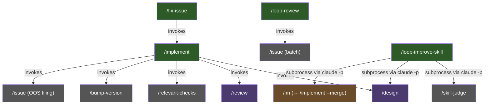
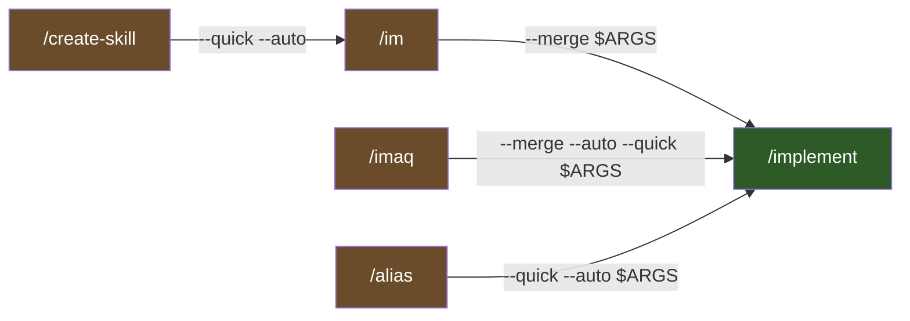
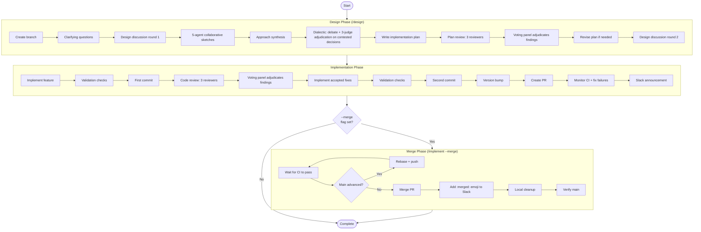

# Workflow Lifecycle

How skills compose to form end-to-end dev workflow in Larch.

## Skill Orchestration Hierarchy

Skills not flat sequence. Form hierarchical call graph — higher-level **stateful orchestrators** invoke lower-level skills, continue based on side effects. Diagram below show only true orchestrators + direct sub-skills; pure forwarders (`/im`, `/imaq`, `/create-skill`) covered separately in [Delegation Topology](#delegation-topology) subsection below — run no post-delegation logic. `/alias` hybrid (validate → delegate → verify) — also appear in Delegation Topology subsection.

- **`/implement`** — top orchestrator. Run full design → code → review → PR by default. With `--merge` flag, also run CI+rebase+merge loop + local cleanup after PR. Step 9a.1 also invoke `/issue` in batch mode to file accepted OOS findings as GitHub issues.
- **`/loop-review`** — partition codebase into slices, review each with 3-reviewer panel, invoke `/issue` in batch mode to file every actionable finding as deduplicated GitHub issue (labeled `loop-review`) — accumulate up to 3 slices per `/issue` invocation before flush so `/issue`'s 2-phase LLM dedup run once per batch. Security-tagged findings held locally per SECURITY.md, not auto-filed.
- **`/fix-issue`** — process one approved GitHub issue per invocation. Fetch open issues with `GO` sentinel comment, skip any with open blockers, triage against codebase, classify complexity (SIMPLE/HARD), delegate to `/implement` with mode-appropriate flags (`--quick` for SIMPLE, full for HARD; always `--merge`).
- **`/loop-improve-skill`** — iteratively improve existing skill. Create tracking GitHub issue, establish session tmpdir under canonical `/tmp`, then run up to 10 improvement rounds directly from bash driver at `${CLAUDE_PLUGIN_ROOT}/skills/loop-improve-skill/scripts/driver.sh`, invoking each child skill (`/skill-judge`, `/design`, `/im`) as fresh `claude -p` subprocess (closes #273). Halt class eliminated by construction: each child's report is its subprocess's output, so no post-child-return model turn can halt. **Termination contract: strive for grade A.** Driver's primary success exit when `${CLAUDE_PLUGIN_ROOT}/scripts/parse-skill-judge-grade.sh` report per-dimension grade A on every D1..D8 dimension (integer thresholds D1>=18/20, D2-D6+D8>=14/15, D7>=9/10). Authoritative loop exits: (a) grade A achieved (terminal happy), (b) infeasibility halts (`no_plan` / `design_refusal` / `im_verification_failed`) with written justification at `iter-${ITER}-infeasibility.md` — driver's Step 5 close-out embed in tracking-issue comment, (c) `max iterations (10) reached` (Step 5 then run one final `/skill-judge` to capture post-iter-cap grade, auto-generate justification listing remaining non-A dimensions — or reclassify as happy post-cap A exit if final judge show grade A). **Observability tradeoff**: partial runs NOT resumable via sentinel ledger — killed driver lose in-flight iteration state. Intentional simplification per #273 design: halt class that motivated pre-rewrite resume machinery eliminated by construction, so resume machinery unnecessary. Prior inner `/loop-improve-skill-iter` skill retired.

## Delegation Topology

Pure forwarders **not** orchestrators — validate input (when applicable), call Skill tool exactly once, exit. Run no logic after child returns. Subsection also document `/alias`, hybrid: validate, delegate to `/implement`, then mechanical sentinel-file verification (see `/alias` Step 4). Edges labeled with **arguments passed on that edge** (what immediate child receives), not final expansion — for single-hop delegation (`/im`, `/imaq`, `/alias`) also what `/implement` see, but for two-hop chain `/create-skill → /im → /implement`, `CREATE→IM` edge show only what `/im` receive; `/im` then prepend `--merge` so `/implement` see `--merge --quick --auto <feature-desc>`.

- **`/im`** — prepend `--merge` to `$ARGUMENTS`, forward to `/implement`. Equivalent to `/implement --merge <args>`.
- **`/imaq`** — prepend `--merge --auto --quick`. Equivalent to `/implement --merge --auto --quick <args>`.
- **`/alias`** — hybrid: validate alias name, delegate to `/implement --quick --auto` to scaffold new project-level alias skill under `.claude/skills/`, then sentinel-file verification (Step 4) that expected `SKILL.md` actually written. Accept optional `--merge` to merge alias-creation PR.
- **`/create-skill`** — validate name + description, delegate to `/im --quick --auto` (expand to `/implement --merge --quick --auto`) to scaffold new larch-style skill. Auto-merge default. Accept `--merge` as backward-compat no-op. `/create-skill --plugin` write under `skills/`; default `.claude/skills/<name>/`. Scaffold process also emit post-scaffold doc-sync checklist via `skills/create-skill/scripts/post-scaffold-hints.sh` — reminders to update README catalog, `.claude/settings.json` permissions, this file (`docs/workflow-lifecycle.md`), and (when applicable) `docs/agents.md`, `docs/review-agents.md`, `AGENTS.md` canonical sources.

Pure forwarders (`/im`, `/imaq`, `/create-skill`) exempt from post-invocation-verification + anti-halt-continuation rules in `skills/shared/subskill-invocation.md`. `/alias` NOT exempt — carry both post-invocation sentinel check + anti-halt banner/micro-reminder. See that doc for full classification rules.

## End-to-End Flow

Full lifecycle when run `/implement <feature description>`:

## Standalone Usage

Not every task need full `/implement` pipeline. Skills usable independently:

- **`/design [--auto] [--debug] <feature>`** — Plan feature without implementing. Create branch, run 5-agent collaborative sketches, write + review plan with 3-reviewer panel + voting.
- **`/review [--debug]`** — Review current branch changes. Launch reviewers, run voting on findings, implement accepted fixes, re-run validation checks in recursive loop.
- **`/research [--debug] <topic>`** — Read-only-repo investigation. No branch create, no modify tracked repo files, no commits. Skill-scoped `scripts/deny-edit-write.sh` PreToolUse hook enforce contract mechanically: `Edit`/`Write`/`NotebookEdit` calls permitted only when target path resolve under canonical `/tmp`. May invoke `/issue` via Skill tool to file research-result issues.
- **`/fix-issue [--debug] [<number-or-url>]`** — Process one approved GitHub issue per invocation. Triage, classify SIMPLE/HARD, delegate to `/implement`. Single-iteration; caller handle repetition.
- **`/loop-improve-skill <skill-name>`** — Iterate judge → plan → implement over existing skill up to 10 rounds via bash driver that invoke each child skill as fresh `claude -p` subprocess (halt class eliminated by construction, closes #273). Strive grade A on every `/skill-judge` dimension (D1..D8); stop happy when achieved, with written infeasibility justification (no plan / `/design` refusal / `/im` verification failed) appended to tracking-issue comment, or with auto-generated infeasibility justification (post-iter-cap final `/skill-judge` re-evaluation) when 10-iteration cap reached.
- **`/alias [--merge] <name> <skill> [flags...]`** — Create project-level alias skill in `.claude/skills/` that forward to larch skill with preset flags. Delegate to `/implement --quick --auto` for full pipeline (code review, version bump, PR). `--merge` also merge PR after CI pass.
- **`/create-skill [--plugin] [--multi-step] [--merge] [--debug] <name> <desc>`** — Scaffold new larch-style skill. Validate inputs, delegate to `/im --quick --auto` (auto-merge default). See [Delegation Topology](#delegation-topology) above for full chain + post-scaffold sync obligations.
- **`/issue [--input-file F] [--title-prefix P] [--label L]... [--go] [<desc>]`** — Create one or more GitHub issues with 2-phase LLM-based semantic duplicate detection.

Shortcut aliases (covered in [Delegation Topology](#delegation-topology)):
- **`/im <args>`** ≡ `/implement --merge <args>`
- **`/imaq <args>`** ≡ `/implement --merge --auto --quick <args>`

## Flags

Flags modify behavior across skill hierarchy:

| Flag | Available on | Effect |
|---|---|---|
| `--quick` | `/implement` | Skip `/design` (produce inline plan instead). Simplify code review to 1 round with 1 Claude Code Reviewer subagent only (no external reviewers, no voting panel). |
| `--auto` | `/implement`, `/design` | Suppress all interactive question checkpoints. Skills run fully autonomous, no user interaction. |
| `--merge` | `/implement` | Run CI+rebase+merge loop, :merged: emoji, local branch cleanup, main verification after PR. Without `--merge`, `/implement` create PR and stop (initial CI wait, Slack announcement, rejected findings report, final report, temp cleanup still run). |
| `--debug` | `/implement`, `/design`, `/review`, `/research`, `/loop-review` | Enable verbose output: descriptive Bash tool descriptions, full explanatory prose between tool calls, per-reviewer individual completion messages alongside compact status table. Default (no `--debug`) use minimal output with compact status tables + suppressed prose. `/implement` auto-propagate `--debug` to `/design` and `/review`. `/loop-review`'s `--debug` control only own verbosity (no downstream propagation — `/issue` no `--debug` flag). |

## Conditional Steps

Certain workflow steps depend on config prerequisites, skipped when unavailable:

- **Slack announcements** — Need Slack config. When unavailable, announcement step skipped with warning but workflow continue.
- **CI monitoring** — Need repo identification. When unavailable, CI monitoring skipped.
- **Version bump** — Need `/bump-version` skill defined in repo. When absent, version bump step skipped with warning.
- **External reviewers (Cursor, Codex)** — When unavailable, Claude Code Reviewer subagent fallbacks replace them so per-skill lane/voter counts stay constant in most phases (3 for plan/code review, `/research`, `/loop-review`; 5 for `/design` sketch phase; 3 for voting panels; 3 for `/design` dialectic judge panel). Review still land because unified Code Reviewer archetype what each fallback reviewer run; losing external tool mean losing harness diversity but not coverage.
- **Dialectic debate buckets (`/design` Step 2a.5)** — Unlike phases above, dialectic **debate** phase does NOT replace unavailable tool with Claude subagent. When assigned external tool (Cursor for odd-indexed decisions, Codex for even) unavailable, bucket **skipped entirely**, `Disposition: bucket-skipped` resolution written (synthesis decision stand for that point). Carve-out apply to debate execution only — post-debate **judge panel** use replacement-first normally. See [External Reviewers](external-reviewers.md#dialectic-specific-behavior) and `skills/shared/dialectic-protocol.md` for details.

## Resolution Protocols

Different skills use different protocols for resolving review findings:

| Protocol | Used by | Mechanism |
|---|---|---|
| [Voting](voting-process.md) | `/design`, `/review` | 3-agent panel vote YES/NO/EXONERATE. 2+ YES required to accept. |
| Negotiation | `/research`, `/loop-review` | Up to N rounds back-and-forth with external reviewers. Claude make final call. |

See [Voting Process](voting-process.md) for full details on voting protocol.
