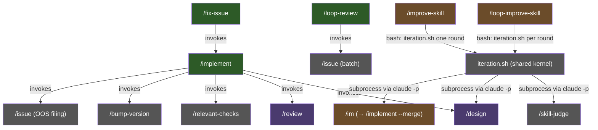

# Workflow Lifecycle

How skills compose to form the end-to-end development workflow in Larch.

## Skill Orchestration Hierarchy

Skills are not invoked in a flat sequence. They form a hierarchical call graph where higher-level **stateful orchestrators** invoke lower-level skills and continue execution based on their side effects. The diagram below shows only true orchestrators and their direct sub-skills; pure forwarders (`/im`, `/imaq`, `/create-skill`, `/loop-improve-skill`, `/improve-skill`, `/simplify-skill`, `/compress-skill`) are covered separately in the [Delegation Topology](#delegation-topology) subsection below because they run no post-delegation logic (`/loop-improve-skill` and `/improve-skill` are delegator-class via their bash drivers, not Skill-tool chains). `/alias` is a hybrid (validate → delegate → verify) — it also appears in the Delegation Topology subsection.



- **`/implement`** — top-level orchestrator. Runs the full design → code → review → PR workflow by default. With the `--merge` flag, also runs the CI+rebase+merge loop and local cleanup after PR creation. Step 0.5 resolves tracking-issue state (sentinel reuse, `--issue <N>` adoption, or `Closes #<N>` recovery from the current branch's PR body); the tracking issue's anchor comment is the single source of truth for full report content (voting tallies, rejected findings, version-bump reasoning, diagrams, OOS observation links, execution issues, run statistics), with the PR body as a slim projection (Summary + diagrams + Test plan + `Closes #<N>` — diagrams appear in both places by design). Step 9a.1 additionally invokes `/issue` in batch mode to file accepted OOS findings as GitHub issues; when Step 0.5 took Branch 4 (no sentinel, no `--issue`, no `Closes #<N>` recovery), the tracking issue is first created at Step 9a.1. See `skills/implement/SKILL.md` Step 0.5 Branches 1-4 for the full adoption-vs-creation flow.
- **`/loop-review`** — partitions the codebase into slices, reviews each with a 3-reviewer panel, and invokes `/issue` in batch mode to file every actionable finding as a deduplicated GitHub issue (labeled `loop-review`) — accumulating up to 3 slices per `/issue` invocation before flushing so `/issue`'s 2-phase LLM dedup runs once per batch. Security-tagged findings are held locally per SECURITY.md rather than auto-filed.
- **`/fix-issue`** — processes one approved GitHub issue per invocation. Fetches open issues with a `GO` sentinel comment, skips any with open blockers, triages, and classifies intent (PR/NON_PR) and — for PR tasks — complexity (SIMPLE/HARD). PR tasks delegate to `/implement` with mode-appropriate flags (`--quick` for SIMPLE, full for HARD; always `--merge`) and forward `--issue $ISSUE_NUMBER` so the queue issue is adopted as the tracking issue (no separate tracking issue is created); NON_PR tasks run inline (typically filing findings via `/issue`) and never call `/implement`.
- **`/loop-improve-skill`** — iteratively improves an existing skill. Creates a tracking GitHub issue, establishes a session tmpdir under canonical `/tmp`, then runs up to 10 improvement rounds directly from a bash driver at `${CLAUDE_PLUGIN_ROOT}/skills/loop-improve-skill/scripts/driver.sh`. The per-iteration body (judge → design → im) lives in the shared kernel at `${CLAUDE_PLUGIN_ROOT}/skills/improve-skill/scripts/iteration.sh` — invoked once per round via direct bash call (not nested `claude -p`) with `--work-dir $LOOP_TMPDIR --iter-num $ITER --issue $ISSUE_NUM`. Halt class stays eliminated by construction (closes #273): the kernel runs each child skill (`/skill-judge`, `/design`, `/im`) as a fresh `claude -p` subprocess, and the driver → kernel edge is a plain bash call. Per-iteration state flows from kernel to driver via a 9-key KV footer on iteration.sh stdout (emitted via EXIT trap so the driver always sees a result, even on abnormal abort). **Termination contract: strive for grade A.** The driver's primary success exit is when `${CLAUDE_PLUGIN_ROOT}/scripts/parse-skill-judge-grade.sh` reports per-dimension grade A on every D1..D8 dimension (integer thresholds D1>=18/20, D2-D6+D8>=14/15, D7>=9/10). Authoritative loop exits: (a) grade A achieved (terminal happy), (b) infeasibility halts (`no_plan` / `design_refusal` / `im_verification_failed`) with a written justification at `iter-${ITER}-infeasibility.md` that the driver's Step 5 close-out embeds in the tracking-issue comment, (c) `max iterations (10) reached` (Step 5 then runs one final `/skill-judge` via a slim local helper to capture the post-iter-cap grade and auto-generates a justification listing remaining non-A dimensions — or reclassifies as a happy post-cap A exit if the final judge shows grade A). **Observability tradeoff**: partial runs are NOT resumable via sentinel ledger — a killed driver loses in-flight iteration state. This is an intentional simplification per the #273 design: the halt class that motivated the pre-rewrite resume machinery has been eliminated by construction, so the resume machinery is unnecessary. The prior inner `/loop-improve-skill-iter` skill is retired.
- **`/improve-skill`** — single-iteration sibling of `/loop-improve-skill`. Invokes the same kernel (`${CLAUDE_PLUGIN_ROOT}/skills/improve-skill/scripts/iteration.sh`) exactly once. Standalone mode creates its own tracking GitHub issue and its own session tmpdir, cleaned up via EXIT trap; users can adopt an existing issue with `--issue <N>` (which is how `/loop-improve-skill`'s driver reuses a single issue across all 10 rounds). The amended `/design` prompt inside the kernel carries a **narrow per-finding pushback carve-out**: `/design` may disagree with specific `/skill-judge` findings via a dedicated `## Pushback on judge findings` subsection, each entry citing the finding, specific reasoning for why it is misapplied, and concrete codebase evidence (file:line). Pushback is strictly per-finding; the plan must still address every undisputed non-A dimension; the existing no-minor-self-curtail / no-budget-self-curtail / no-no-plan-sentinel rules stay in force.

## Delegation Topology

Pure forwarders are **not** orchestrators — they validate input (when applicable), call the Skill tool exactly once, and exit. They run no logic after the child returns. This subsection also documents `/alias`, which is a hybrid: it validates, delegates to `/implement`, and then performs a mechanical sentinel-file verification (see `/alias` Step 4). Edges are labeled with the **arguments passed on that edge** (what the immediate child receives), not the final expansion — for single-hop delegation (`/im`, `/imaq`, `/alias`) this is also what `/implement` sees, but for the two-hop chains `/create-skill → /im → /implement` and `/compress-skill → /imaq → /implement`, the first edge shows only what the intermediate forwarder receives; the forwarder then prepends its own flags (`/im` adds `--merge`; `/imaq` adds `--merge --auto --quick`) before `/implement` sees the final expansion.

```mermaid
graph LR
    CREATE["/create-skill"] -->|--quick --auto| IM
    SIMPLIFY["/simplify-skill"] -->|$ARGS (feature-desc)| IM
    COMPRESS["/compress-skill"] -->|$ARGS (feature-desc)| IMAQ
    IM["/im"] -->|--merge $ARGS| IMPLEMENT["/implement"]
    IMAQ["/imaq"] -->|--merge --auto --quick $ARGS| IMPLEMENT
    ALIAS["/alias"] -->|--quick --auto $ARGS| IMPLEMENT

    style CREATE fill:#6b4c2a,color:#fff
    style SIMPLIFY fill:#6b4c2a,color:#fff
    style COMPRESS fill:#6b4c2a,color:#fff
    style IM fill:#6b4c2a,color:#fff
    style IMAQ fill:#6b4c2a,color:#fff
    style ALIAS fill:#6b4c2a,color:#fff
    style IMPLEMENT fill:#2d5a27,color:#fff
```

- **`/im`** — prepends `--merge` to `$ARGUMENTS` and forwards to `/implement`. Equivalent to `/implement --merge <args>`.
- **`/imaq`** — prepends `--merge --auto --quick`. Equivalent to `/implement --merge --auto --quick <args>`.
- **`/alias`** — hybrid: validates alias name, delegates to `/implement --quick --auto` to scaffold a new project-level alias skill under `.claude/skills/`, then performs a sentinel-file verification (Step 4) that the expected `SKILL.md` was actually written. Accepts optional `--merge` to merge the alias-creation PR.
- **`/create-skill`** — validates name + description, then delegates to `/im --quick --auto` (which expands to `/implement --merge --quick --auto`) to scaffold a new larch-style skill. Auto-merge is the default. Accepts `--merge` as a backward-compat no-op. `/create-skill --plugin` writes under `skills/`; default is `.claude/skills/<name>/`. The scaffold process also emits a post-scaffold doc-sync checklist via `skills/create-skill/scripts/post-scaffold-hints.sh` — reminders to update the README catalog, `.claude/settings.json` permissions, this file (`docs/workflow-lifecycle.md`), and (when applicable) `docs/agents.md`, `docs/review-agents.md`, and `AGENTS.md` canonical sources.
- **`/simplify-skill`** — accepts a single target-skill name (bare form; `/` prefix tolerated), resolves the target directory (plugin tree first, then consumer `.claude/skills/`, then `${CLAUDE_PLUGIN_ROOT}/.claude/skills/`), enumerates every `.md` file physically under that directory (excluding `scripts/` and `tests/`), and delegates a pinned behavior-preserving refactor feature description to `/im` (which expands to `/implement --merge`). Sub-skills invoked via the `Skill` tool are out of scope by construction (they live in sibling `skills/OTHER/` directories so never appear in the find output). `skills/shared/*.md` is out of scope by policy (cross-skill blast radius — refactor separately). The feature description requires a `## Token budget` section in the PR body tracking SKILL.md line/char deltas. Helper script: `skills/simplify-skill/scripts/build-feature-description.sh` (fail-closed on bad name / not found).
- **`/compress-skill`** — pure forwarder. Resolves the target skill directory, enumerates the transitively-reachable `.md` set inside it, snapshots baseline byte/line counts, and delegates a behavior-preserving prose-rewrite feature description to `/imaq` (which expands to `/implement --merge --auto --quick`) so changes ship as an auto-merged PR. See the Standalone Usage entry for full scope rules and the `## Token budget` PR-body contract.

Pure forwarders (`/im`, `/imaq`, `/create-skill`, `/loop-improve-skill`, `/improve-skill`, `/simplify-skill`, `/compress-skill`) are exempt from the post-invocation-verification and anti-halt-continuation rules defined in `skills/shared/subskill-invocation.md` (`/loop-improve-skill` and `/improve-skill` are delegator-class via their bash drivers, not Skill-tool chains). `/alias` is NOT exempt — it carries both the post-invocation sentinel check and the anti-halt banner/micro-reminder. See that document for the full classification rules.

## End-to-End Flow

The full lifecycle when running `/implement <feature description>`:


## Standalone Usage

Not every task requires the full `/implement` pipeline. Skills can be used independently:

- **`/design [--auto] [--debug] <feature>`** — Plan a feature without implementing it. Creates a branch, runs 5-agent collaborative sketches, writes and reviews the plan with a 3-reviewer panel + voting.
- **`/review [--debug]`** — Review the current branch's changes. Launches reviewers, runs voting on findings, implements accepted fixes, and re-runs validation checks in a recursive loop.
- **`/research [--debug] <topic>`** — Read-only-repo investigation. Does not create branches, modify tracked repo files, or make commits. The skill-scoped `scripts/deny-edit-write.sh` PreToolUse hook enforces the contract mechanically: `Edit`/`Write`/`NotebookEdit` calls are permitted only when the target path resolves under canonical `/tmp`. May invoke `/issue` via the Skill tool to file research-result issues.
- **`/fix-issue [--debug] [--no-slack] [<number-or-url>]`** — Process one approved GitHub issue per invocation. Triages, classifies intent (PR/NON_PR) and — for PR tasks — complexity (SIMPLE/HARD). PR tasks delegate to `/implement` with `--issue $ISSUE_NUMBER` forwarded (so the queue issue is adopted as the tracking issue — no separate tracking issue is created) and `--no-slack` propagated when set so the delegated `/implement` run does NOT post to Slack; NON_PR tasks run inline and never call `/implement` — their own Step 8 Slack announcement also honors `--no-slack`. Single-iteration; caller handles repetition.
- **`/loop-improve-skill [--no-slack] <skill-name>`** — Iterate judge → plan → implement over an existing skill up to 10 rounds. Driver invokes the shared `/improve-skill` iteration kernel once per round (direct bash call; kernel spawns each child skill as a fresh `claude -p` subprocess, halt class eliminated by construction per #273). Strives for grade A on every `/skill-judge` dimension (D1..D8); stops happy when achieved, with written infeasibility justification (no plan / `/design` refusal / `/im` verification failed) appended to the tracking-issue comment, or with auto-generated infeasibility justification (post-iter-cap final `/skill-judge` re-evaluation) when the 10-iteration cap is reached. `--no-slack` is prepended to every iteration's `/larch:im` prompt so no iteration posts to Slack. Default: each iteration posts per `/implement`'s default-on behavior — up to 10 Slack posts per loop.
- **`/improve-skill [--no-slack] [--issue <N>] <skill-name>`** — Run exactly one iteration of the judge → plan → implement pipeline (the same kernel `/loop-improve-skill` reuses). Standalone invocation creates its own GitHub tracking issue; `--issue <N>` adopts an existing one. Amended `/design` prompt includes a **narrow per-finding pushback carve-out**: `/design` may surface disagreement with specific `/skill-judge` findings via a `## Pushback on judge findings` subsection with detailed per-finding justification and concrete file:line evidence. The carve-out is strictly per-finding — existing no-self-curtail / no-budget / no-no-plan-sentinel rules remain in force.
- **`/alias [--merge] [--no-slack] <name> <skill> [flags...]`** — Create a project-level alias skill in `.claude/skills/` that forwards to a larch skill with preset flags. Delegates to `/implement --quick --auto` for the full pipeline (code review, version bump, PR). `--merge` also merges the PR after CI passes. `--no-slack` (when placed before the first positional) forwards to `/implement` so the alias-creation run does NOT post to Slack; `--no-slack` placed after the first positional is passed through verbatim as a preset flag for the generated alias.
- **`/create-skill [--plugin] [--multi-step] [--merge] [--debug] [--no-slack] <name> <desc>`** — Scaffold a new larch-style skill. Validates inputs, delegates to `/im --quick --auto` (auto-merges by default; forwards `--no-slack` so the scaffold run does NOT post a Slack announcement when set). See [Delegation Topology](#delegation-topology) above for the full chain and post-scaffold sync obligations.
- **`/simplify-skill [--debug] [--no-slack] <skill-name>`** — Refactor an existing skill for stronger adherence to `skills/shared/skill-design-principles.md` and reduced SKILL.md token footprint. Resolves the target, enumerates in-scope `.md` files (excludes `scripts/`, `tests/`, `skills/shared/`, and sub-skills invoked via the `Skill` tool), and delegates a behavior-preserving refactor to `/im` (forwards `--no-slack` so the refactor run does NOT post a Slack announcement when set). PR body includes a `## Token budget` section.
- **`/compress-skill [--debug] [--no-slack] <skill-name-or-path>`** — Rewrite an existing skill's Markdown prose to reduce size while preserving meaning. Discovers the transitively included `.md` set (BFS from `SKILL.md` following both Markdown links and backticked `${CLAUDE_PLUGIN_ROOT}/...`-style path citations, restricted to the skill's own directory tree), snapshots byte/line counts, and delegates a behavior-preserving prose rewrite to `/imaq` (forwards `--no-slack` so the compression run does NOT post a Slack announcement when set) applying Strunk & White's *Elements of Style* adapted for technical writing. Structural elements (YAML frontmatter, fenced code blocks, headings, link targets, inline code, file paths, numeric values, identifiers) are preserved verbatim; only prose is rewritten. PR body includes a `## Token budget` section with per-file before/after byte and line deltas.
- **`/issue [--input-file F] [--title-prefix P] [--label L]... [--go] [<desc>]`** — Create one or more GitHub issues with 2-phase LLM-based semantic duplicate detection.

Shortcut aliases (covered in [Delegation Topology](#delegation-topology)):
- **`/im <args>`** ≡ `/implement --merge <args>`
- **`/imaq <args>`** ≡ `/implement --merge --auto --quick <args>`

## Flags

Flags modify behavior across the skill hierarchy:

| Flag | Available on | Effect |
|---|---|---|
| `--quick` | `/implement` | Skips `/design` (produces inline plan instead). Simplifies code review to a single-reviewer loop of up to 7 rounds with a per-round Cursor → Codex → Claude Code Reviewer subagent fallback chain (no voting panel). |
| `--auto` | `/implement`, `/design` | Suppresses all interactive question checkpoints. Skills run fully autonomously without user interaction. |
| `--merge` | `/implement` | Runs the CI+rebase+merge loop, local branch cleanup, and main verification after PR creation. Without `--merge`, `/implement` creates the PR and stops after the initial CI wait; the final Step 16a Slack issue post still runs in both cases (gated on Slack env vars + `--no-slack`). |
| `--no-slack` | `/implement`, `/fix-issue`, `/simplify-skill`, `/compress-skill`, `/create-skill`, `/alias`, `/loop-improve-skill`, `/improve-skill` (plus aliases generated by `/alias` — `$ARGUMENTS` passthrough lets `--no-slack` flow through `/im`, `/imaq`, and other forwarders to `/implement`) | Suppresses the default-on Slack post. On `/implement`, Step 16a posts a single tracking-issue status message near end-of-run (✅ closed / 📝 PR opened / ❌ blocked / ❓ needs user input) as the git user (`git config user.name` → Slack `username`); requires `LARCH_SLACK_BOT_TOKEN` and `LARCH_SLACK_CHANNEL_ID`. Default behavior (no `--no-slack`) posts when env vars are configured; `--no-slack` opts out. Every downstream skill accepts `--no-slack` and forwards it to its `/implement` (or `/im` / `/imaq`) invocation. `/loop-improve-skill` propagates `--no-slack` to every iteration's `/larch:im`. |
| `--debug` | `/implement`, `/design`, `/review`, `/research`, `/loop-review` | Enables verbose output: descriptive Bash tool descriptions, full explanatory prose between tool calls, per-reviewer individual completion messages alongside the compact status table. Default (no `--debug`) uses minimal output with compact status tables and suppressed prose. `/implement` auto-propagates `--debug` to `/design` and `/review`. `/loop-review`'s `--debug` controls only its own verbosity (no downstream propagation — `/issue` has no `--debug` flag). |

## Conditional Steps

Certain steps in the workflow depend on configuration prerequisites and are skipped when unavailable:

- **Slack announcements** — On by default when Slack configuration (`LARCH_SLACK_BOT_TOKEN` + `LARCH_SLACK_CHANNEL_ID`) is present. `/implement` Step 16a posts a single tracking-issue status message near the end of each run. Pass `--no-slack` to opt out. With missing env vars (and `--no-slack` not set), the step is skipped with a warning at session setup. The workflow continues in both cases.
- **CI monitoring** — Requires repository identification. When unavailable, CI monitoring is skipped.
- **Version bump** — Requires a `/bump-version` skill defined in the repo. When absent, the version bump step is skipped with a warning.
- **External reviewers (Cursor, Codex)** — When unavailable, Claude Code Reviewer subagent fallbacks replace them so the per-skill lane/voter counts remain constant in most phases (3 for plan/code review, `/research`, and `/loop-review`; 5 for the `/design` sketch phase; 3 for voting panels; 3 for the `/design` dialectic judge panel). The review still lands because the unified Code Reviewer archetype is what each fallback reviewer runs; losing the external tool means losing harness diversity but not coverage.
- **Dialectic debate buckets (`/design` Step 2a.5)** — Unlike the phases above, the dialectic **debate** phase does NOT replace an unavailable tool with a Claude subagent. When the assigned external tool (Cursor for odd-indexed decisions, Codex for even) is unavailable, the bucket is **skipped entirely** and a `Disposition: bucket-skipped` resolution is written (the synthesis decision stands for that point). This carve-out applies to debate execution only — the post-debate **judge panel** uses replacement-first normally. See [External Reviewers](external-reviewers.md#dialectic-specific-behavior) and `skills/shared/dialectic-protocol.md` for details.

## Resolution Protocols

Different skills use different protocols for resolving review findings:

| Protocol | Used by | Mechanism |
|---|---|---|
| [Voting](voting-process.md) | `/design`, `/review` | 3-agent panel votes YES/NO/EXONERATE. 2+ YES required to accept. |
| Negotiation | `/research`, `/loop-review` | Up to N rounds of back-and-forth with external reviewers. Claude makes the final call. |

See [Voting Process](voting-process.md) for full details on the voting protocol.
